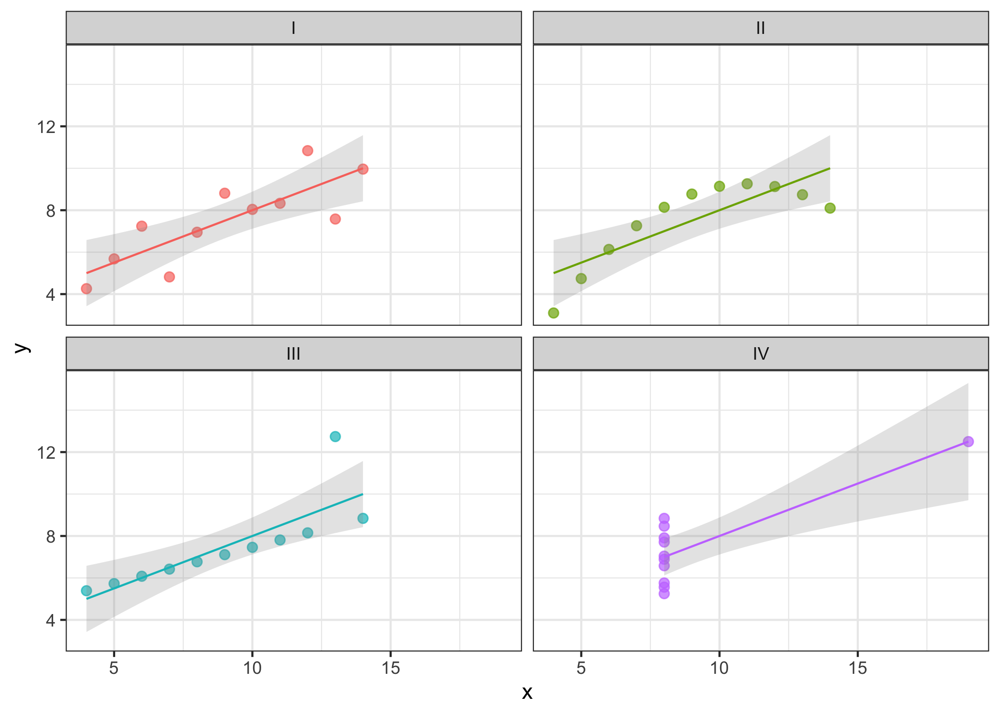
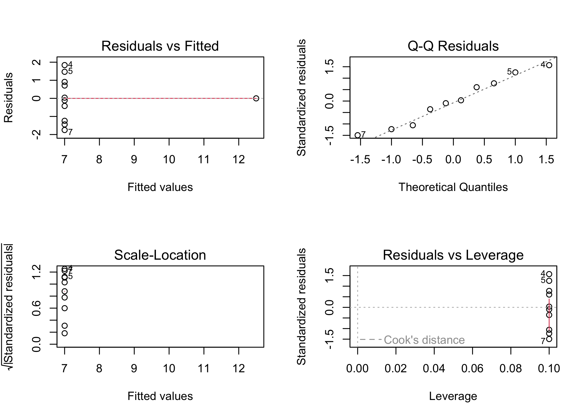

Anscombe’s Quartet: Summary Stats vs. Plots
================
Patrick Cherry
2023-07-11

- [Import and tidy up data](#import-and-tidy-up-data)
- [Analyze visually](#analyze-visually)
- [Analyze with summary stats](#analyze-with-summary-stats)
  - [Other stats](#other-stats)
- [Conclusions](#conclusions)
  - [Further reading](#further-reading)

Anscombe’s quartet is a set of four x : y value pairs
[published](https://github.com/pdcherry/statistics/blob/main/code_and_data/anscombe1973.pdf)
by F J Anscombe in American Statistician in 1793. The sets have nearly
identical descriptive statistics, like mean, standard deviation, R^2
correlation, and least-squares regression slopes, (to ~ 3 decimal
places), but are clearly very different data sets when visualized by
plotting.

Anscombe intended the data sets to illustrate that descriptive
statistics, while helpful, are incomplete, and can obscure important
trends or caveats in the data that are very easily observed visually.

> “…make both calculations and graphs. Both sorts of output should be
> studied; each will contribute to understanding.” — F J Anscombe

## Import and tidy up data

``` r
anscombe_import <- read_excel("Anscombes_quartet_raw_data.xlsx", col_names = FALSE)
```

``` r
anscombe_tidy <- anscombe_import %>%
  as_cells() %>%
  behead("up-left", "data_group") %>%
  behead("up", "coord") %>%
  pivot_wider(id_cols = c(data_group, row),
              names_from = coord,
              values_from = chr) %>%
  select(!row) %>%
  mutate(x = round(as.numeric(x), 2),
         y = round(as.numeric(y), 2))

head(anscombe_tidy)
```

<div class="kable-table">

| data_group |   x |    y |
|:-----------|----:|-----:|
| I          |  10 | 8.04 |
| I          |   8 | 6.95 |
| I          |  13 | 7.58 |
| I          |   9 | 8.81 |
| I          |  11 | 8.33 |
| I          |  14 | 9.96 |

</div>

## Analyze visually

``` r
anscombe_plots <- anscombe_tidy %>%
  ggplot(aes(y = y, x = x, color = data_group)) +
  geom_point(size = 2, alpha = 0.7) +
  stat_smooth(formula = "y~x", method = "lm", linewidth = .5, alpha = 0.25) +
  facet_wrap(~ data_group) +
  theme(legend.position = "none")
anscombe_plots
```

<!-- -->

These sets are quite different.

- Set I is a fairly typical set of points roughly linearly arranged
  upward and to the right, with roughly homoscedastic distribution. This
  distribution is exactly what linear least squares regressions are good
  at handling and commenting on in their descriptive statistics.
- Set II is a very nearly arranges upside-down arc that looks like a
  parabola. Such an arrangement indicates a linear regression is not an
  appropriate model and will poorly summarize the data.
- Set III is a very linear and straight looking data set——save for one
  extreme outlier point that likely skews any model that attempts to fit
  it in with the other points.
- Set IV is a set of 10 high variance points at one x-value, and one
  very high leverage point at an extremity far away x-value that, due to
  its leverage and Cook’s Distance, will exert an out-sized effect on
  the regression; indeed, despite being one point, the regression line
  passes directly though the extreme point.

## Analyze with summary stats

``` r
summary_stats <- anscombe_tidy %>%
  group_by(data_group) %>%
  nest() %>%
  mutate("lm" = map(data, ~lm(y ~ x, data = .x)),
         "glance" = map(lm, glance),
         "terms" = map(lm, tidy),
         "mean_x" = map(data, ~mean(.$x))[[1]],
         "mean_y" = map(data, ~mean(.$y))[[1]],
         "sd_x" = map(data, ~sd(.$x))[[1]],
         "sd_y" = map(data, ~sd(.$y))[[1]]) %>%
  unnest(c("glance", "terms"), names_repair = tidyr_legacy) %>%
  filter(term != "(Intercept)") %>%
  relocate(data_group, data_group, r.squared, estimate, mean_x, mean_y, sd_x, sd_y, std.error, statistic1) %>%
  mutate(across(where(is.numeric), ~round(.x, 3)))

summary_stats %>% select(data_group, r.squared, estimate, mean_x, mean_y, sd_x, sd_y)
```

<div class="kable-table">

| data_group | r.squared | estimate | mean_x | mean_y |  sd_x |  sd_y |
|:-----------|----------:|---------:|-------:|-------:|------:|------:|
| I          |     0.667 |      0.5 |      9 |  7.501 | 3.317 | 2.032 |
| II         |     0.666 |      0.5 |      9 |  7.501 | 3.317 | 2.032 |
| III        |     0.666 |      0.5 |      9 |  7.500 | 3.317 | 2.030 |
| IV         |     0.667 |      0.5 |      9 |  7.501 | 3.317 | 2.031 |

</div>

The Coefficient of determination of the model (R^2), the slope
(estimate), and the means and standard deviations of the x and y
coordinates are all the same to within 2 decimal places.

### Other stats

``` r
summary_stats %>% select(!c(estimate, mean_x, mean_y, sd_x, sd_y, data, lm, adj.r.squared, df, term))
```

<div class="kable-table">

| data_group | r.squared | std.error | statistic1 | sigma | statistic | p.value |  logLik |    AIC |    BIC | deviance | df.residual | nobs | p.value1 |
|:-----------|----------:|----------:|-----------:|------:|----------:|--------:|--------:|-------:|-------:|---------:|------------:|-----:|---------:|
| I          |     0.667 |     0.118 |      4.241 | 1.237 |    17.990 |   0.002 | -16.841 | 39.681 | 40.875 |   13.763 |           9 |   11 |    0.002 |
| II         |     0.666 |     0.118 |      4.239 | 1.237 |    17.966 |   0.002 | -16.846 | 39.692 | 40.886 |   13.776 |           9 |   11 |    0.002 |
| III        |     0.666 |     0.118 |      4.239 | 1.236 |    17.972 |   0.002 | -16.838 | 39.676 | 40.870 |   13.756 |           9 |   11 |    0.002 |
| IV         |     0.667 |     0.118 |      4.243 | 1.236 |    18.003 |   0.002 | -16.833 | 39.665 | 40.859 |   13.742 |           9 |   11 |    0.002 |

</div>

Interestingly, some analysis outputs not described as being the same
between the data sets are similar: the standard errors, are all the same
to three decimal places, and thus so are the overall model p-values.

Some other statistics do subtly differ between the datasets: the AICs
and BICs (Akaike information criteria) are each subtly different,
indicating different likelihoods of the model based on the information
contained in the data.

#### Further exploration of set IV

``` r
par(mfrow = (c(2,2)))
plot(summary_stats$lm[[4]])
```

    ## Warning: not plotting observations with leverage one:
    ##   8

<!-- -->

``` r
cooks.distance(summary_stats$lm[[4]])
```

    ##            1            2            3            4            5            6 
    ## 7.165166e-03 6.225950e-02 2.032144e-02 1.367179e-01 8.723799e-02 6.148813e-05 
    ##            7            8            9           10           11 
    ## 1.239465e-01          NaN 8.394407e-02 3.340334e-02 4.980902e-04

Oh wow, point 8’s Cook’s Distance was not able to be calculated; it made
the NaN error. That is likely because a regression cannot be performed
on the remaining points because they all occur at a single x-value.

## Conclusions

There are numerous reasons to plot and visualize distributions of data
and relationships of data points instead of only viewing summary
statistics. Finding outliers, seeing higher order patterns, and viewing
high leverage points are among the reasons to plot and visualize data in
additional to studying their quantitative descriptive statistics.

### Further reading

Justin Matejka and George Fitzmaurice invented a method in 2017 to form
plots of point to approximate arbitrary patterns that still match
specific summary statistics in “[Same Stats, Different Graphs:
Generating Datasets with Varied Appearance and Identical Statistics
through Simulated
Annealing](https://web.archive.org/web/20201004003855/https://www.autodesk.com/research/publications/same-stats-different-graphs)”.
