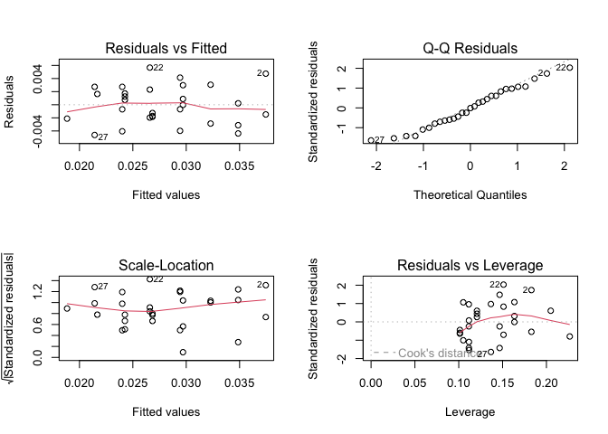

emmeans: Estimated marginal means
================
Patrick Cherry
2023-05-02

- <a href="#the-pigs-dataset" id="toc-the-pigs-dataset">The pigs
  dataset</a>
  - <a href="#initial-model-fitting" id="toc-initial-model-fitting">Initial
    model fitting</a>
- <a href="#estimated-marginal-means"
  id="toc-estimated-marginal-means">Estimated marginal means</a>
  - <a href="#comparison-to-ordinary-means"
    id="toc-comparison-to-ordinary-means">Comparison to ordinary means</a>
- <a href="#the-reference-grid-and-definition-of-emms"
  id="toc-the-reference-grid-and-definition-of-emms">The reference grid,
  and definition of EMMs</a>

Estimated marginal means (EMMs, previously known as least-squares means
in the context of traditional regression models) are derived by using a
model to make predictions over a regular grid of predictor combinations
(called a reference grid).

# The pigs dataset

## Initial model fitting

Consider the pigs dataset provided with the package (help(“pigs”)
provides details). These data come from an experiment where pigs are
given different percentages of protein (percent) from different sources
(source) in their diet, and later we measured the concentration (conc)
of leucine. The percent values are quantitative, but we chose those
particular values deliberately, and (at least initially) we want
separate estimates at each percent level; that is, we want to view
percent as a factor, not a quantitative predictor.

As discussed, our first task is to come up with a good model. Doing so
requires a lot of skill, and we don’t want to labor too much over the
details; you really need other references to deal with this aspect
adequately. But we will briefly discuss five models and settle on one of
them:

``` r
mod1 <- lm(conc ~ source * factor(percent), data = pigs)
par(mfrow = c(2,2)); plot(mod1)
```

<!-- -->

``` r
mod2 <- update(mod1, . ~ source + factor(percent))   # no interaction
par(mfrow = c(2,2)); plot(mod2)
```

<!-- -->

``` r
map_dfr(list(mod1, mod2), glance)
```

<div class="kable-table">

| r.squared | adj.r.squared |    sigma | statistic |   p.value |  df |    logLik |      AIC |      BIC | deviance | df.residual | nobs |
|----------:|--------------:|---------:|----------:|----------:|----:|----------:|---------:|---------:|---------:|------------:|-----:|
| 0.8083816 |     0.6843933 | 4.716024 |  6.519819 | 0.0003417 |  11 | -78.38304 | 182.7661 | 200.5409 | 378.0950 |          17 |   29 |
| 0.6996728 |     0.6343843 | 5.075926 | 10.716628 | 0.0000207 |   5 | -84.89886 | 183.7977 | 193.3688 | 592.5957 |          23 |   29 |

</div>

These models have R2 values of 0.808 and 0.700, and adjusted R2 values
of 0.684 and 0.634. mod1 is preferable to mod2, suggesting we need the
interaction term. However, a residual-vs-predicted plot of mod2 has a
classic “horn” shape (curving and fanning out), indicating a situation
where a response transformation might help better than including the
interaction.

It turns out that an inverse transformation, (1/conc) really serves us
well. (Perhaps this isn’t too surprising, as concentrations are
typically determined by titration, in which the actual measurements are
volumes; and these are reciprocally related to concentrations, i.e.,
amounts per unit volume.)

So here are three more models:

``` r
mod3 <- update(mod1, inverse(conc) ~ .)
mod4 <- update(mod2, inverse(conc) ~ .)     # no interaction
mod5 <- update(mod4, . ~ source + percent)  # linear term for percent
par(mfrow = c(2,2)); plot(mod5)
```

<!-- -->

``` r
map_dfr(list(mod1, mod2, mod3, mod4, mod5), glance)
```

<div class="kable-table">

| r.squared | adj.r.squared |     sigma | statistic |   p.value |  df |    logLik |       AIC |       BIC |    deviance | df.residual | nobs |
|----------:|--------------:|----------:|----------:|----------:|----:|----------:|----------:|----------:|------------:|------------:|-----:|
| 0.8083816 |     0.6843933 | 4.7160240 |  6.519819 | 0.0003417 |  11 | -78.38304 |  182.7661 |  200.5409 | 378.0950000 |          17 |   29 |
| 0.6996728 |     0.6343843 | 5.0759265 | 10.716628 | 0.0000207 |   5 | -84.89886 |  183.7977 |  193.3688 | 592.5956760 |          23 |   29 |
| 0.8175928 |     0.6995647 | 0.0031259 |  6.927099 | 0.0002349 |  11 | 133.86797 | -241.7359 | -223.9611 |   0.0001661 |          17 |   29 |
| 0.7866455 |     0.7402641 | 0.0029065 | 16.960361 | 0.0000005 |   5 | 131.59563 | -249.1912 | -239.6202 |   0.0001943 |          23 |   29 |
| 0.7487292 |     0.7185767 | 0.0030254 | 24.831412 | 0.0000001 |   3 | 129.22377 | -248.4475 | -241.6111 |   0.0002288 |          25 |   29 |

</div>

(Note: We could have used 1/conc as the response variable, but emmeans
provides an equivalent inverse() function that will prove more
advantageous later.) The residual plots for these models look a lot more
like a random scatter of points (and that is good). The R2 values for
these models are 0.818, 0.787, and 0.749, respectively; and the adjusted
R2s are 0.700, 0.740, and 0.719. mod4 has the best adjusted R2 and will
be our choice.

# Estimated marginal means

``` r
(EMM.source <- emmeans(mod4, "source"))
```

    ##  source emmean       SE df lower.CL upper.CL
    ##  fish   0.0337 0.000926 23   0.0318   0.0356
    ##  soy    0.0257 0.000945 23   0.0237   0.0276
    ##  skim   0.0229 0.000994 23   0.0208   0.0249
    ## 
    ## Results are averaged over the levels of: percent 
    ## Results are given on the inverse (not the response) scale. 
    ## Confidence level used: 0.95

``` r
(EMM.percent <- emmeans(mod4, "percent"))
```

    ##  percent emmean       SE df lower.CL upper.CL
    ##        9 0.0322 0.001032 23   0.0301   0.0344
    ##       12 0.0270 0.000969 23   0.0250   0.0290
    ##       15 0.0263 0.001104 23   0.0240   0.0286
    ##       18 0.0241 0.001337 23   0.0213   0.0268
    ## 
    ## Results are averaged over the levels of: source 
    ## Results are given on the inverse (not the response) scale. 
    ## Confidence level used: 0.95

Calling `tidy()` (from `broom`) on the object will put it into a
beautiful data frame. we could make a plot.

``` r
tidy(EMM.percent)
```

<div class="kable-table">

| percent |  estimate | std.error |  df | statistic | p.value |
|--------:|----------:|----------:|----:|----------:|--------:|
|       9 | 0.0322476 | 0.0010322 |  23 |  31.24043 |       0 |
|      12 | 0.0270034 | 0.0009688 |  23 |  27.87243 |       0 |
|      15 | 0.0262765 | 0.0011040 |  23 |  23.80154 |       0 |
|      18 | 0.0240784 | 0.0013370 |  23 |  18.00911 |       0 |

</div>

## Comparison to ordinary means

Let’s compare these with the ordinary marginal means (OMMs) on
inverse(conc):

``` r
with(pigs, tapply(inverse(conc), source, mean))
```

    ##       fish        soy       skim 
    ## 0.03331687 0.02632333 0.02372024

Can I write the above ordinary means in Tidyverse/dplyr language?

``` r
pigs %>%
  mutate(conc = 1/conc) %>%
  summarize(mean = mean(conc), .by = source)
```

<div class="kable-table">

| source |      mean |
|:-------|----------:|
| fish   | 0.0333169 |
| soy    | 0.0263233 |
| skim   | 0.0237202 |

</div>

``` r
with(pigs, tapply(inverse(conc), percent, mean))
```

    ##          9         12         15         18 
    ## 0.03146170 0.02700341 0.02602757 0.02659336

``` r
pigs %>%
  mutate(conc = 1/conc) %>%
  summarize(mean = mean(conc), .by = percent)
```

<div class="kable-table">

| percent |      mean |
|--------:|----------:|
|       9 | 0.0314617 |
|      12 | 0.0270034 |
|      15 | 0.0260276 |
|      18 | 0.0265934 |

</div>

Both sets of OMMs are vaguely similar to the corresponding EMMs.
However, please note that the EMMs for percent form a decreasing
sequence, while the the OMMs decrease but then increase at the end.

# The reference grid, and definition of EMMs

Estimated marginal means are defined as marginal means of model
predictions over the grid comprising all factor combinations – called
the reference grid. For the example at hand, the reference grid is

``` r
(RG <- expand.grid(source = levels(pigs$source), percent = unique(pigs$percent)))
```

<div class="kable-table">

| source | percent |
|:-------|--------:|
| fish   |       9 |
| soy    |       9 |
| skim   |       9 |
| fish   |      12 |
| soy    |      12 |
| skim   |      12 |
| fish   |      15 |
| soy    |      15 |
| skim   |      15 |
| fish   |      18 |
| soy    |      18 |
| skim   |      18 |

</div>

To get the EMMs, we first need to obtain predictions on this grid:

``` r
(preds <- matrix(predict(mod4, newdata = RG), nrow = 3))
```

    ##            [,1]       [,2]       [,3]       [,4]
    ## [1,] 0.03853514 0.03329091 0.03256404 0.03036586
    ## [2,] 0.03050486 0.02526063 0.02453376 0.02233558
    ## [3,] 0.02770292 0.02245869 0.02173182 0.01953364

then obtain the marginal means of these predictions:

``` r
apply(preds, 1, mean)   # row means -- for source
```

    ## [1] 0.03368899 0.02565870 0.02285677

``` r
apply(preds, 2, mean)   # column means -- for percent
```

    ## [1] 0.03224764 0.02700341 0.02627654 0.02407836

These marginal averages match the EMMs obtained earlier via `emmeans()`.

Now let’s go back to the comparison with the ordinary marginal means.
The source levels are represented by the columns of pred; and note that
each row of pred is a decreasing set of values. So it is no wonder that
the marginal means – the EMMs for source – are decreasing. That the OMMs
for percent do not behave this way is due to the imbalance in sample
sizes:

``` r
with(pigs, table(source, percent))
```

    ##       percent
    ## source 9 12 15 18
    ##   fish 2  3  2  3
    ##   soy  3  3  3  1
    ##   skim 3  3  2  1

This shows that the OMMs of the last column give most of the weight
(3/5) to the first source, which tends to have higher inverse(conc),
making the OMM for 18 percent higher than that for 15 percent, even
though the reverse is true with every level of source. This kind of
disconnect is an example of Simpson’s paradox, in which a confounding
factor can distort your findings. The EMMs are not subject to this
paradox, but the OMMs are, when the sample sizes are correlated with the
expected values.

In summary, we obtain a references grid of all factor combinations,
obtain model predictions on that grid, and then the expected marginal
means are estimated as equally-weighted marginal averages of those
predictions. Those EMMs are not subject to confounding by other factors,
such as might happen with ordinary marginal means of the data. Moreover,
unlike OMMs, EMMs are based on a model that is fitted to the data.
