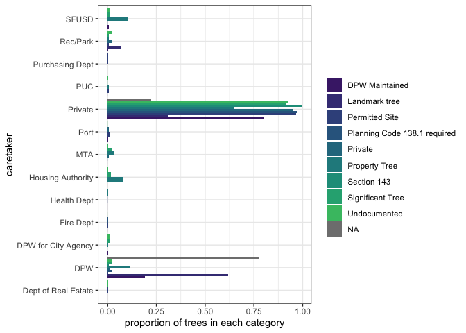
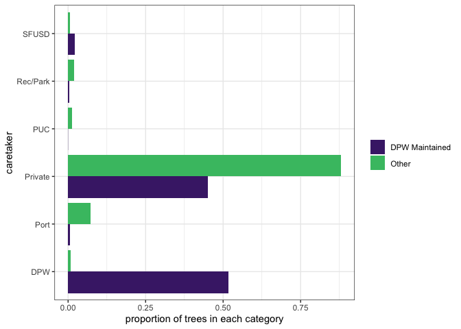
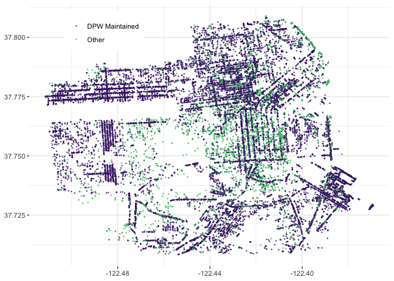
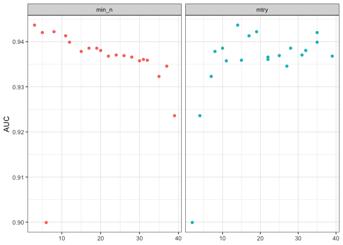
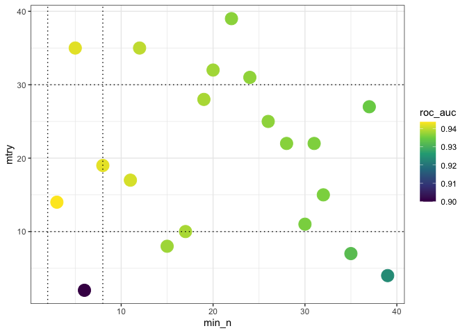
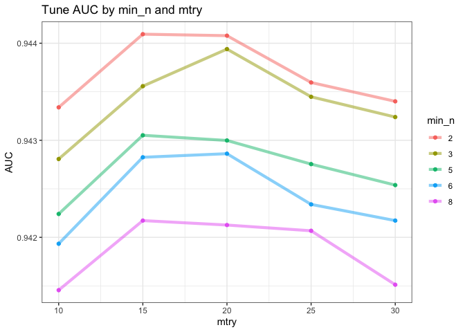
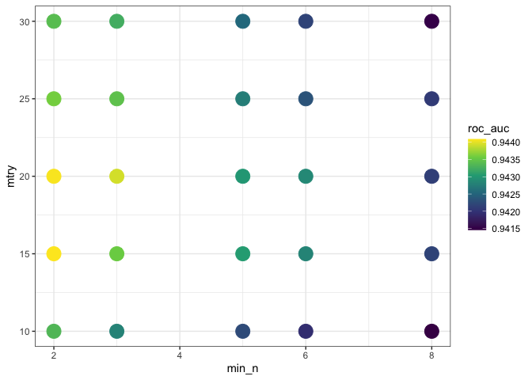
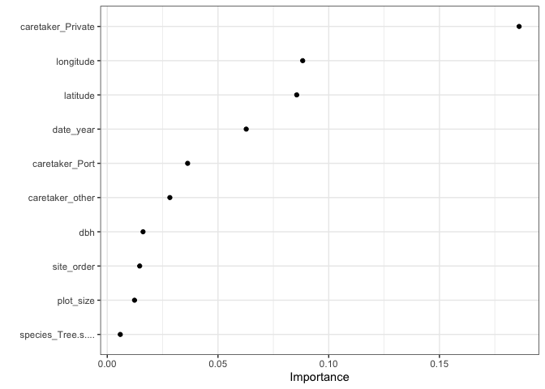
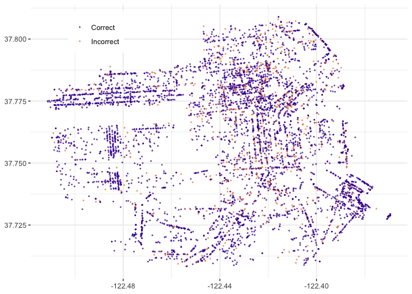

Random forest model hyperparameters
================
Patrick Cherry
2023-06-09

- [Get data](#get-data)
- [Preliminary exploration of data](#preliminary-exploration-of-data)
  - [Legal status](#legal-status)
  - [NAs in data](#nas-in-data)
  - [Species](#species)
  - [plot_size](#plot_size)
  - [Prepare data for model](#prepare-data-for-model)
  - [Quick plot/map of data](#quick-plotmap-of-data)
  - [Build Model](#build-model)
  - [Feature engineering for the
    date](#feature-engineering-for-the-date)
    - [Review data preprocessing
      results](#review-data-preprocessing-results)
- [Set up model hyperparameters](#set-up-model-hyperparameters)
  - [Set up worklflow](#set-up-worklflow)
  - [Train-test some model
    hyperparameters](#train-test-some-model-hyperparameters)
    - [view results](#view-results)
  - [Train-test some model
    hyperparameters](#train-test-some-model-hyperparameters-1)
    - [view results](#view-results-1)
- [Finalize the model](#finalize-the-model)
  - [Understand final model](#understand-final-model)
- [Apply the final model](#apply-the-final-model)
  - [Make predictions](#make-predictions)

The goal is the make a predictor of whether a tree tracked in San
Francisco is a Department of Public Works maintained legal status tree,
or some other legal status.

# Get data

This is a 2020-01-28 [Tidy
Tuesday](https://github.com/rfordatascience/tidytuesday/blob/master/data/2020/2020-01-28/readme.md)
dataset. These data are from the San Francisco Public Works’ Bureau of
Urban Forestry.

``` r
sftrees <- read_csv("https://raw.githubusercontent.com/rfordatascience/tidytuesday/master/data/2020/2020-01-28/sf_trees.csv")
```

    ## Rows: 192987 Columns: 12
    ## ── Column specification ────────────────────────────────────────────────────────
    ## Delimiter: ","
    ## chr  (6): legal_status, species, address, site_info, caretaker, plot_size
    ## dbl  (5): tree_id, site_order, dbh, latitude, longitude
    ## date (1): date
    ## 
    ## ℹ Use `spec()` to retrieve the full column specification for this data.
    ## ℹ Specify the column types or set `show_col_types = FALSE` to quiet this message.

# Preliminary exploration of data

``` r
head(sftrees)
```

<div class="kable-table">

| tree_id | legal_status   | species                                | address            | site_order | site_info                    | caretaker | date       | dbh | plot_size | latitude | longitude |
|--------:|:---------------|:---------------------------------------|:-------------------|-----------:|:-----------------------------|:----------|:-----------|----:|:----------|---------:|----------:|
|   53719 | Permitted Site | Tree(s) ::                             | 2963 Webster St    |          1 | Sidewalk: Curb side : Cutout | Private   | 1955-09-19 |  NA | NA        | 37.79787 | -122.4341 |
|   30313 | Permitted Site | Tree(s) ::                             | 501 Arkansas St    |          3 | Sidewalk: Curb side : Cutout | Private   | 1955-10-20 |  NA | NA        | 37.75984 | -122.3981 |
|   30312 | Permitted Site | Tree(s) ::                             | 501 Arkansas St    |          2 | Sidewalk: Curb side : Cutout | Private   | 1955-10-20 |  NA | NA        | 37.75984 | -122.3981 |
|   30314 | DPW Maintained | Pittosporum undulatum :: Victorian Box | 501 Arkansas St    |          1 | Sidewalk: Curb side : Cutout | Private   | 1955-10-20 |  16 | NA        | 37.75977 | -122.3981 |
|   30315 | Permitted Site | Acacia melanoxylon :: Blackwood Acacia | 1190 Sacramento St |          5 | Sidewalk: Curb side : Cutout | Private   | 1955-10-24 |  NA | NA        | 37.79265 | -122.4124 |
|   30316 | Permitted Site | Acacia melanoxylon :: Blackwood Acacia | 1190 Sacramento St |          6 | Sidewalk: Curb side : Cutout | Private   | 1955-10-24 |  NA | NA        | 37.79265 | -122.4124 |

</div>

## Legal status

``` r
sftrees %>%
  count(legal_status, sort = TRUE) %>%
  mutate(percent = round( n / sum(n) * 100, digits = 1))
```

<div class="kable-table">

| legal_status                 |      n | percent |
|:-----------------------------|-------:|--------:|
| DPW Maintained               | 141725 |    73.4 |
| Permitted Site               |  39732 |    20.6 |
| Undocumented                 |   8106 |     4.2 |
| Significant Tree             |   1648 |     0.9 |
| Planning Code 138.1 required |    971 |     0.5 |
| Property Tree                |    316 |     0.2 |
| Section 143                  |    230 |     0.1 |
| Private                      |    163 |     0.1 |
| NA                           |     54 |     0.0 |
| Landmark tree                |     42 |     0.0 |

</div>

``` r
sftrees %>% count(legal_status, caretaker, sort = TRUE)
```

<div class="kable-table">

| legal_status                 | caretaker               |      n |
|:-----------------------------|:------------------------|-------:|
| DPW Maintained               | Private                 | 113102 |
| Permitted Site               | Private                 |  38312 |
| DPW Maintained               | DPW                     |  26963 |
| Undocumented                 | Private                 |   7463 |
| Significant Tree             | Private                 |   1505 |
| Planning Code 138.1 required | Private                 |    947 |
| DPW Maintained               | SFUSD                   |    898 |
| Permitted Site               | Port                    |    536 |
| DPW Maintained               | Rec/Park                |    281 |
| Permitted Site               | Rec/Park                |    262 |
| Section 143                  | Private                 |    229 |
| Permitted Site               | PUC                     |    208 |
| Property Tree                | Private                 |    202 |
| Undocumented                 | DPW                     |    200 |
| DPW Maintained               | Port                    |    182 |
| Undocumented                 | Rec/Park                |    165 |
| Private                      | Private                 |    155 |
| DPW Maintained               | DPW for City Agency     |    111 |
| Undocumented                 | SFUSD                   |    100 |
| Permitted Site               | Purchasing Dept         |     81 |
| Undocumented                 | DPW for City Agency     |     75 |
| Permitted Site               | Dept of Real Estate     |     64 |
| NA                           | DPW                     |     42 |
| Permitted Site               | DPW                     |     39 |
| Property Tree                | DPW                     |     35 |
| Undocumented                 | MTA                     |     34 |
| Permitted Site               | Fire Dept               |     33 |
| Property Tree                | SFUSD                   |     33 |
| Significant Tree             | DPW                     |     33 |
| DPW Maintained               | Fire Dept               |     32 |
| Significant Tree             | MTA                     |     32 |
| Permitted Site               | Police Dept             |     31 |
| DPW Maintained               | Health Dept             |     27 |
| Permitted Site               | Health Dept             |     27 |
| Permitted Site               | SFUSD                   |     27 |
| DPW Maintained               | PUC                     |     26 |
| Landmark tree                | DPW                     |     26 |
| Permitted Site               | Mayor Office of Housing |     26 |
| Property Tree                | Housing Authority       |     25 |
| Significant Tree             | Housing Authority       |     25 |
| Permitted Site               | Office of Mayor         |     24 |
| Undocumented                 | PUC                     |     24 |
| Planning Code 138.1 required | DPW                     |     23 |
| Significant Tree             | SFUSD                   |     23 |
| DPW Maintained               | Dept of Real Estate     |     17 |
| Permitted Site               | MTA                     |     17 |
| DPW Maintained               | Police Dept             |     16 |
| Permitted Site               | War Memorial            |     15 |
| Significant Tree             | DPW for City Agency     |     14 |
| Undocumented                 | Housing Authority       |     14 |
| Undocumented                 | Public Library          |     14 |
| Landmark tree                | Private                 |     13 |
| NA                           | Private                 |     12 |
| DPW Maintained               | MTA                     |     11 |
| DPW Maintained               | Public Library          |     11 |
| DPW Maintained               | Arts Commission         |     10 |
| DPW Maintained               | Mayor Office of Housing |     10 |
| Permitted Site               | Arts Commission         |     10 |
| Property Tree                | MTA                     |     10 |
| DPW Maintained               | Housing Authority       |      9 |
| Permitted Site               | City College            |      9 |
| Permitted Site               | Public Library          |      9 |
| Significant Tree             | Rec/Park                |      9 |
| Undocumented                 | Dept of Real Estate     |      6 |
| DPW Maintained               | Asian Arts Commission   |      5 |
| DPW Maintained               | War Memorial            |      5 |
| Property Tree                | Arts Commission         |      5 |
| Undocumented                 | Port                    |      5 |
| DPW Maintained               | Purchasing Dept         |      4 |
| Private                      | Rec/Park                |      4 |
| Landmark tree                | Rec/Park                |      3 |
| Significant Tree             | Arts Commission         |      3 |
| Significant Tree             | Police Dept             |      3 |
| Undocumented                 | Arts Commission         |      3 |
| DPW Maintained               | City College            |      2 |
| DPW Maintained               | Office of Mayor         |      2 |
| Permitted Site               | DPW for City Agency     |      2 |
| Private                      | DPW                     |      2 |
| Property Tree                | PUC                     |      2 |
| Property Tree                | Rec/Park                |      2 |
| Undocumented                 | Fire Dept               |      2 |
| DPW Maintained               | Cleary Bros. Landscape  |      1 |
| Planning Code 138.1 required | Fire Dept               |      1 |
| Private                      | MTA                     |      1 |
| Private                      | Port                    |      1 |
| Property Tree                | DPW for City Agency     |      1 |
| Property Tree                | Health Dept             |      1 |
| Section 143                  | DPW                     |      1 |
| Significant Tree             | PUC                     |      1 |
| Undocumented                 | Asian Arts Commission   |      1 |

</div>

So the `legal_status` of “DPW Maintained” does not equate with a
`caretaker` of “DPW”—in fact, most of the time, DPW-legal status trees
are privately taken care of.

``` r
col_plot_legalstatus_by_caretaker <- sftrees %>%
  count(legal_status, caretaker) %>%
  add_count(caretaker, wt = n, name = "caretaker_count") %>%
  filter(caretaker_count > 50) %>%
  group_by(legal_status) %>%
  mutate(percent_legal = n / sum(n)) %>%
  ggplot(aes(percent_legal, caretaker, fill = legal_status)) +
  geom_col(position = "dodge") +
  scale_fill_viridis_d(option = "D", begin = 0.1, end = 0.7, na.value = "grey50") +
  labs(fill = NULL,
       x = "proportion of trees in each category")
col_plot_legalstatus_by_caretaker
```

<!-- -->

## NAs in data

``` r
sftrees %>%
  summarise(across(everything(), ~ sum(is.na(.x))),
            "n" = n()) %>%
  relocate(n) %>%
  t() %>% as_tibble(.name_repair = "minimal", rownames = "col_name")
```

<div class="kable-table">

| col_name     |        |
|:-------------|-------:|
| n            | 192987 |
| tree_id      |      0 |
| legal_status |     54 |
| species      |      0 |
| address      |   1487 |
| site_order   |   1634 |
| site_info    |      0 |
| caretaker    |      0 |
| date         | 124610 |
| dbh          |  41819 |
| plot_size    |  50013 |
| latitude     |   2832 |
| longitude    |   2832 |

</div>

The glimpse just turns the data to print left to right. The `n` column
at the start shows how many rows are in the dataframe; the other named
columns show how many `NA`s are in the data in each column. The `date`
and `dhb` [(Diameter at breast
height)](https://en.wikipedia.org/wiki/Diameter_at_breast_height)
columns show significant levels of NAs (64.5% and 21.7%, respectively).

## Species

``` r
sftrees %>% count(species, sort = TRUE)
```

<div class="kable-table">

| species                                                                           |     n |
|:----------------------------------------------------------------------------------|------:|
| Tree(s) ::                                                                        | 11629 |
| Platanus x hispanica :: Sycamore: London Plane                                    | 11557 |
| Metrosideros excelsa :: New Zealand Xmas Tree                                     |  8744 |
| Lophostemon confertus :: Brisbane Box                                             |  8581 |
| Tristaniopsis laurina :: Swamp Myrtle                                             |  7197 |
| Pittosporum undulatum :: Victorian Box                                            |  7122 |
| Prunus cerasifera :: Cherry Plum                                                  |  6716 |
| Magnolia grandiflora :: Southern Magnolia                                         |  6285 |
| Arbutus ‘Marina’ :: Hybrid Strawberry Tree                                        |  5702 |
| Ficus microcarpa nitida ‘Green Gem’ :: Indian Laurel Fig Tree ‘Green Gem’         |  5624 |
| Prunus serrulata ‘Kwanzan’ :: Kwanzan Flowering Cherry                            |  4025 |
| Acacia melanoxylon :: Blackwood Acacia                                            |  3956 |
| Maytenus boaria :: Mayten                                                         |  3899 |
| Olea europaea :: Olive Tree                                                       |  3694 |
| Corymbia ficifolia :: Red Flowering Gum                                           |  3575 |
| Callistemon citrinus :: Lemon Bottlebrush                                         |  3266 |
| Ginkgo biloba :: Maidenhair Tree                                                  |  3212 |
| Pyrus calleryana :: Ornamental Pear                                               |  2969 |
| Prunus serrulata :: Ornamental Cherry                                             |  2696 |
| Eriobotrya deflexa :: Bronze Loquat                                               |  2402 |
| Ulmus parvifolia :: Chinese Elm                                                   |  2366 |
| Pinus radiata :: Monterey Pine                                                    |  2278 |
| Ligustrum lucidum :: Glossy Privet                                                |  2185 |
| Pyrus kawakamii :: Evergreen Pear                                                 |  1974 |
| Cupressus macrocarpa :: Monterey Cypress                                          |  1922 |
| ::                                                                                |  1839 |
| Tristaniopsis laurina ‘Elegant’ :: Small-leaf Tristania ‘Elegant’                 |  1797 |
| Pittosporum crassifolium :: Karo Tree                                             |  1795 |
| Melaleuca quinquenervia :: Cajeput                                                |  1736 |
| Cordyline australis :: Dracena Palm                                               |  1640 |
| Ficus nitida :: Laurel Fig                                                        |  1632 |
| Myoporum laetum :: Myoporum                                                       |  1590 |
| Liquidambar styraciflua :: American Sweet Gum                                     |  1520 |
| Juniperus chinensis :: Juniper                                                    |  1404 |
| Ficus retusa nitida :: Banyan Fig                                                 |  1387 |
| Tristania conferta ::                                                             |  1373 |
| Jacaranda mimosifolia :: Jacaranda                                                |  1170 |
| Lagunaria patersonii :: Primrose Tree                                             |  1077 |
| Schinus terebinthifolius :: Brazilian Pepper                                      |  1059 |
| Eucalyptus polyanthemos :: Silver Dollar Eucalyptus                               |  1005 |
| Washingtonia robusta :: Mexican Fan Palm                                          |   994 |
| Ficus microcarpa :: Chinese Banyan                                                |   966 |
| Callistemon viminalis :: Weeping Bottlebrush                                      |   950 |
| Magnolia grandiflora ‘Little Gem’ :: Little Gem Magnolia                          |   935 |
| Agonis flexuosa :: Peppermint Willow                                              |   913 |
| Phoenix canariensis :: Canary Island Date Palm                                    |   893 |
| Acer rubrum :: Red Maple                                                          |   890 |
| Syagrus romanzoffianum :: Queen Palm                                              |   859 |
| Ceratonia siliqua :: Carob                                                        |   855 |
| Laurus nobilis :: Sweet Bay: Grecian Laurel                                       |   855 |
| Acacia baileyana :: Bailey’s Acacia                                               |   834 |
| Rhaphiolepis Majestic Beauty :: Indian Hawthorn ‘Majestic Beau’                   |   808 |
| Eucalyptus sideroxylon :: Red Ironbark                                            |   718 |
| Crataegus phaenopyrum :: Washington Hawthorn                                      |   708 |
| Afrocarpus gracilior :: Fern Pine                                                 |   665 |
| Arbutus unedo :: Strawberry Tree                                                  |   632 |
| Rhamnus alaternus :: Italian Buckthorn                                            |   618 |
| Quercus agrifolia :: Coast Live Oak                                               |   598 |
| Pyrus calleryana ‘Aristocrat’ :: Aristocrat Callery Pear                          |   574 |
| Fraxinus uhdei :: Shamel Ash: Evergreen Ash                                       |   557 |
| Eucalyptus Spp :: Eucalyptus                                                      |   551 |
| Lyonothamnus floribundus subsp. asplenifolius :: Santa Cruz Ironwood              |   548 |
| Leptospermum scoparium :: New Zealand Tea Tree                                    |   504 |
| Eucalyptus globulus :: Blue Gum                                                   |   497 |
| Crataegus laevigata :: English Hawthorn                                           |   492 |
| Syzygium paniculatum :: Brush Cherry                                              |   489 |
| Geijera parviflora :: Australian Willow                                           |   487 |
| Platanus x hispanica ‘Yarwood’ :: Yarwood Sycamore                                |   438 |
| Ulmus pumila :: Siberian Elm                                                      |   429 |
| Pinus pinea :: Italian Stone Pine                                                 |   428 |
| Pistacia chinensis :: Chinese Pistache                                            |   428 |
| Trachycarpus fortunei :: Windmill Palm                                            |   421 |
| Acer palmatum :: Japanese Maple                                                   |   412 |
| Leptospermum laevigatum :: Australian Tea Tree                                    |   406 |
| Dodonaea viscosa :: Hop Bush                                                      |   400 |
| Acer buergeranum :: Trident Maple                                                 |   395 |
| Pinus canariensis :: Canary Island Pine                                           |   393 |
| Yucca gloriosa :: Spanish Dagger                                                  |   390 |
| Magnolia grandiflora ‘Samuel Sommer’ :: Samuel Sommer Magnolia                    |   380 |
| Taxus baccata :: Irish Yew                                                        |   379 |
| Dodonaea viscosa ‘Purpurea’ :: Purple Hopseed Bush                                |   368 |
| Melaleuca linariifolia :: Flaxleaf Paperbark                                      |   357 |
| Schinus molle :: California Pepper                                                |   350 |
| Sequoia sempervirens :: Coast Redwood                                             |   341 |
| Fraxinus spp :: Ash Spp                                                           |   332 |
| Photinia fraseri :: Photinia: Chinese photinia                                    |   332 |
| Populus nigra ‘Italica’ :: Lombardy Poplar                                        |   329 |
| Acacia stenophylla :: Shoestring Acacia                                           |   326 |
| Liriodendron tulipifera :: Tulip Tree                                             |   320 |
| Ceanothus ‘Ray Hartman’ :: California Lilac ‘Ray Hartman’                         |   314 |
| Pittosporum tenuifolium :: Tawhiwhi Pittosporum                                   |   306 |
| Prunus blireiana :: Flowering Plum                                                |   302 |
| Magnolia grandiflora ‘Saint Mary’ :: Saint Mary Magnolia                          |   296 |
| Ulmus americana :: American Elm                                                   |   286 |
| Fraxinus oxycarpa ‘Raywood’ :: Raywood Ash                                        |   276 |
| Prunus x yedoensis :: Yoshino Cherry                                              |   268 |
| Prunus cerasifera ‘Krauter vesuvius’ :: Purple Leaf Plum Krauter Vesuvius         |   267 |
| Koelreuteria paniculata :: Golden Rain Tree                                       |   260 |
| Melaleuca ericifolia :: Heath Melaleuca                                           |   258 |
| Pinus Spp :: Pine Spp                                                             |   257 |
| Cupaniopsis anacardioides :: Carrotwood                                           |   251 |
| Olea europaea ‘Fruitless’ :: Fruitless Olive                                      |   249 |
| Quercus suber :: Cork Oak                                                         |   247 |
| Magnolia doltsopa :: Himalayan Magnolia                                           |   242 |
| Podocarpus gracilor :: Fern Pine                                                  |   226 |
| Podocarpus macrophyllus :: Yew Pine                                               |   226 |
| Celtis sinensis :: Chinese Hackberry                                              |   222 |
| Robinia x ambigua ‘Purple Robe’ :: Purple Robe Locust                             |   218 |
| Chamaerops humilis :: Mediterranean Fan Palm                                      |   210 |
| Pyrus calleryana ‘Chanticleer’ :: Ornamental Pear Tree ‘Chanticleer’              |   201 |
| Eucalyptus nicholii :: Nichol’s Willow-Leafed Peppermint                          |   200 |
| Prunus domestica ‘Mariposa’ :: Mariposa Plum                                      |   194 |
| Ulmus spp :: Elm Spp                                                              |   194 |
| Eriobotrya japonica :: Edible Loquat                                              |   183 |
| Acacia longifolia :: Golden Wattle                                                |   180 |
| Cupressus sempervirens :: Italian Cypress                                         |   176 |
| Pyrus calleryana ‘Bradford’ :: Ornamental Pear: Bradford                          |   171 |
| Ligustrum japonicum :: Japanese Privet                                            |   168 |
| Betula pendula :: European White Birch                                            |   161 |
| Acer x freemanii :: Freeman Maple                                                 |   160 |
| Cotoneaster SPP :: Cotoneaster                                                    |   160 |
| Ginkgo biloba ‘Autumn Gold’ :: Ginkgo: Autumn Gold                                |   159 |
| Agonis flexuosa ‘After Dark’ :: Peppermint willow ‘After Dark’                    |   155 |
| Cedrus deodara :: Deodar Cedar                                                    |   154 |
| Prunus spp :: Cherry                                                              |   154 |
| Ulmus parvifolia ‘Drake’ :: Drake’s Chinese Elm                                   |   154 |
| Tilia cordata :: Littleleaf Linden                                                |   153 |
| Cupressocyparis leylandii :: Leyland Cypress                                      |   151 |
| Magnolia grandiflora ‘Russet’ :: Russet Magnolia                                  |   147 |
| Pittosporum eugenioides :: Tarata                                                 |   147 |
| Thuja occidentalis ‘Emerald’ :: Emerald Arborvitae                                |   146 |
| Melaleuca nesophila :: Pink Melaleuca                                             |   144 |
| Citrus spp :: Lemon: Orange: Lime                                                 |   143 |
| Quercus ilex :: Holly Oak                                                         |   143 |
| Malus floribunda :: Showy Crab Apple: Japanese Crabapple                          |   142 |
| Ceanothus Sps :: California lilac                                                 |   141 |
| Hymenosporum flavum :: Sweet Shade                                                |   140 |
| Cinnamomum camphora :: Camphor Tree                                               |   139 |
| Photinia fraseri :: Photinia Tree                                                 |   136 |
| Prunus cerasifera ‘Atropurpurea’ :: Purple-Leaf Plum                              |   134 |
| Leptospermum scoparium ‘Ruby Glow’ :: New Zealand Ruby Glow Tea Tree              |   131 |
| Arecastrum romanzoffianum :: Queen Palm                                           |   130 |
| Olea europaea ‘Wilsonii’ :: Wilson Olive Semi-fruitless                           |   126 |
| Malus :: Crab Apple                                                               |   121 |
| Robinia x ambigua :: Locust                                                       |   118 |
| Aesculus x carnea :: Red Horse Chestnut                                           |   116 |
| Shrub :: Shrub                                                                    |   116 |
| Brahea edulis :: Guadalupe Palm                                                   |   108 |
| Acacia spp :: Acacia Spp                                                          |   107 |
| Acer rubrum ‘Red Sunset’ :: Red Swamp Maple                                       |   106 |
| Pinus thunbergii :: Japanese Black Pine                                           |   105 |
| Pittosporum tobira :: Japanese Mockorange                                         |   103 |
| Platanus x hispanica ‘Columbia’ :: Columbia Hybrid Plane Tree                     |   103 |
| Fraxinus oxycarpa :: Ash                                                          |   100 |
| Syzygium australe :: Eugenia                                                      |   100 |
| Gleditsia triacanthos :: Honey Locust                                             |    99 |
| Lagerstroemia indica :: Crape Myrtle                                              |    99 |
| Rhaphiolepis indica :: India Hawthorn                                             |    98 |
| Corymbia maculata :: Spotted Gum                                                  |    97 |
| Grevillea robusta :: Silk Oak Tree                                                |    97 |
| Melaleuca styphelliodes :: Paperbark Tree                                         |    97 |
| Morus alba :: White Mulberry                                                      |    94 |
| Eucalyptus lehmanni :: Bushy Yate                                                 |    92 |
| Magnolia spp :: Magnolia                                                          |    92 |
| Ceiba speciosa :: Silk floss                                                      |    91 |
| Fraxinus americana :: American Ash                                                |    91 |
| Pyrus spp :: Pear Tree                                                            |    91 |
| Liquidambar orientalis :: Oriental Sweet Gum                                      |    90 |
| Magnolia champaca :: Champa                                                       |    89 |
| Brugmansia spp :: Angel trumpet                                                   |    87 |
| Hakea suaveolens :: Sweet Hakea Tree                                              |    86 |
| Eucalyptus camaldulensis :: River Red Gum                                         |    85 |
| Crateagus spp :: Hawthorn                                                         |    84 |
| Cercis occidentalis :: Western Redbud                                             |    82 |
| Acer rubrum ‘Armstrong’ :: Armstrong Red Maple                                    |    81 |
| Olea Majestic Beauty ::                                                           |    81 |
| Persea americana :: Avocado                                                       |    81 |
| Pyrus calleryana ‘New Bradford’ :: New Bradford Pear                              |    81 |
| Acer saccharinum :: Silver Maple                                                  |    80 |
| Zelkova serrata :: Sawleaf Zelkova                                                |    80 |
| Betula spp :: Birch                                                               |    78 |
| Ficus Spp. ::                                                                     |    76 |
| Magnolia x soulangiana :: Saucer Magnolia                                         |    76 |
| Elaeocarpus decipiens :: Japanese Blueberry Tree                                  |    75 |
| Aesculus californica :: California Buckeye                                        |    74 |
| Carpinus betulus :: European Hornbeam                                             |    74 |
| Platanus racemosa :: California Sycamore                                          |    74 |
| Liquidambar styraciflua ‘Rotundiloba’ :: Roundleaf sweetgum                       |    72 |
| Heteromeles arbutifolia :: Toyon                                                  |    67 |
| Potential Site :: Potential Site                                                  |    66 |
| Albizia julibrissin :: Mimosa Silk Tree                                           |    64 |
| Ilex aquifolium :: European Holly                                                 |    61 |
| Quercus virginiana :: Southern Live Oak                                           |    61 |
| Araucaria heterophylla :: Norfolk Island Pine                                     |    60 |
| Ilex spp :: Holly Species                                                         |    60 |
| Pittosporum spp :: Pittosporum spp                                                |    59 |
| Ilex altaclarensis ‘Wilsonii’ :: Wilson Holly Tree                                |    58 |
| Phoenix dactylifera :: Date Palm                                                  |    58 |
| Calocedrus decurrens :: Incense Cedar                                             |    57 |
| Casuarina cunninghamiana :: Horsetail pine                                        |    57 |
| Cedrus atlantica :: Atlas Cedar                                                   |    57 |
| Melaleuca spp :: Melaleuca spp                                                    |    57 |
| Olea europaea ‘Majestic Beauty’ :: Majestic Beauty Fruitless Olive                |    57 |
| Tibochina urvilleana :: Princess Flower                                           |    55 |
| Eriobotrya deflexa ‘Coppertone’ :: Coppertone Loquat                              |    54 |
| Prunus persica :: Peach                                                           |    54 |
| Alnus rhombifolia :: White Alder                                                  |    53 |
| Ficus carica :: Edible Fig                                                        |    53 |
| Azara microphylla :: Little-Leaf Azara                                            |    52 |
| Leptospermum scoparium ‘Helene Strybing’ :: Helene Strybing New Zealand Tea Tree  |    51 |
| Washingtonia filifera :: California Fan Palm                                      |    50 |
| Magnolia grandiflora ‘Majestic Beauty’ :: Majestic Beauty Magnolia                |    49 |
| Cercis canadensis :: Eastern Redbud                                               |    47 |
| Laurus x ‘Saratoga’ :: Hybrid Laurel                                              |    47 |
| Palm (unknown Genus) :: Palm Spp                                                  |    46 |
| Eucalyptus leucoxylon mac ‘Rosea’ :: Yellow Gum                                   |    45 |
| Koelreuteria bipinnata :: Chinese Flame Tree                                      |    45 |
| Dracaena draco :: Dragon Tree                                                     |    43 |
| Acacia decurrens :: Acacia: Silver Wattle                                         |    42 |
| Ginkgo biloba ‘Fairmont’ :: Fairmont Ginkgo                                       |    42 |
| Ulmus ‘Prospector’ :: Prospector Elm                                              |    42 |
| Yucca elephantipes :: Giant Yucca                                                 |    41 |
| Cassia leptophylla :: Gold Medallion Tree                                         |    40 |
| Fraxinus americana ‘Autumn Purple’ :: American Autumn Purple Ash                  |    40 |
| Nerium oleander :: Oleander                                                       |    40 |
| Araucaria columnaris :: Coral reef araucaria                                      |    39 |
| Acer rubrum ‘October Glory’ :: Red October Glory Maple                            |    38 |
| Ginkgo biloba ‘Princeton Sentry’ :: Princeton Sentry Maidenhair                   |    38 |
| Prunus lyonii :: Catalina Cherry                                                  |    38 |
| Ficus rubiginosa :: Port Jackson Fig                                              |    37 |
| Prunus laurocerasus :: English laurel                                             |    37 |
| Prunus spp :: Flowering Plum                                                      |    36 |
| Acer macrophyllum :: Big Leaf Maple                                               |    34 |
| Prunus subhirtella ‘Pendula’ :: Weeping Cherry                                    |    34 |
| Pyracantha ‘Santa Cruz’ :: Firethorn Tree ‘Santa Cruz’                            |    34 |
| Casurina stricta :: Beefwood: Drooping She-Oak                                    |    33 |
| Populus spp :: Poplar Spp                                                         |    33 |
| Prunus caroliniana :: Carolina Cherry Laurel                                      |    32 |
| Acer palmatum ‘Bloodgood’ :: Bloodgood Japanese Maple                             |    31 |
| Corymbia citriodora :: Lemon Scented Gum                                          |    31 |
| Picea Spp :: Spruce Spp                                                           |    31 |
| Acer japonicum :: Japanese Maple                                                  |    30 |
| Celtis occidentalis :: Common Hackberry                                           |    30 |
| Acer spp :: Maple                                                                 |    29 |
| Pseudotsuga menziesii :: Douglas Fir                                              |    29 |
| Robinia pseudoacacia :: Black Locust                                              |    29 |
| Salix spp :: Willow                                                               |    29 |
| Acacia cognata :: River Wattle                                                    |    28 |
| Ficus macrophylla :: Morton Bay Fig                                               |    27 |
| Pinus halepensis :: Allepo Pine                                                   |    27 |
| Acacia baileyana ‘Purpurea’ :: Purple-leaf Acacia                                 |    26 |
| Eucalyptus viminalis :: Manna Gum                                                 |    26 |
| Prunus armeniaca :: Apricot                                                       |    26 |
| Quercus rubra :: Red Oak                                                          |    25 |
| Cercis canadensis ‘Forest Pansy’ :: Forest Pansy Redbud                           |    24 |
| Magnolia grandiflora ‘D.D. Blanchard’ :: D.D. Blanchard Southern Magnolia         |    24 |
| Prunus x yedoensis ‘Akebono’ :: Daybreak Yoshino Cherry                           |    24 |
| Alnus cordata :: Italian Alder                                                    |    23 |
| Archontophoenix cunninghamiana :: King Palm                                       |    23 |
| Bambusa spp :: Bamboo Species                                                     |    23 |
| Celtis australis :: European Hackberry                                            |    23 |
| Eucalyptus pulverulenta :: Silver Mountain Gum Tree                               |    23 |
| Nyssa sylvatica :: Tupelo: Sour Gum                                               |    23 |
| Prunus ilicifoia :: Holly-leaved Cherry                                           |    23 |
| Quillaja saponaria :: Chilean Soapbark                                            |    23 |
| Eucalyptus robusta :: Swamp mahogany                                              |    22 |
| Fremontodendron spp :: Flannel Bush Tree                                          |    22 |
| Quercus spp :: Oak                                                                |    22 |
| Ulmus carpinifolia ‘Frontier’ :: Frontier Elm ‘Frontier’                          |    22 |
| Fagus sylvatica :: European Beech                                                 |    21 |
| Pinus muricata :: Bishop Pine                                                     |    21 |
| Dicksonia antarctica :: Soft Tree Fern                                            |    20 |
| Fraxinus x Moraine :: Moraine Ash                                                 |    20 |
| Aesculus x carnea ‘Briotii’ :: Ruby Horse Chestnut                                |    19 |
| Betula nigra :: River Birch                                                       |    19 |
| Cussonia spicata :: Cabbage tree                                                  |    19 |
| Ficus laurel ::                                                                   |    19 |
| Podocarpus henkelii :: Long-Leafed Yellow-Wood                                    |    19 |
| Quercus coccinea :: Scarlet Oak                                                   |    19 |
| Quercus lobata :: Valley Oak                                                      |    19 |
| Umbellularia californica :: California Bay                                        |    19 |
| Platanus x hispanica ‘Bloodgood’ :: Bloodgood London Plane                        |    18 |
| Pyrus calleryana ‘Redspire’ :: Ornamental Pear Tree ‘Redspire’                    |    18 |
| Salix babylonica :: Weeping Willow                                                |    18 |
| Chitalpa tashkentensis ::                                                         |    17 |
| Persea indica :: Indian Bay                                                       |    17 |
| Private shrub :: Private Shrub                                                    |    17 |
| Rhus lancea :: African Sumac                                                      |    17 |
| Salix matsudana ‘Tortuosa’ :: Corkscrew Willow                                    |    17 |
| Styphnolobium japonicum :: Chinese scholar tree                                   |    17 |
| Acacia cyclops :: Cyclops wattle                                                  |    16 |
| Araucaria araucana :: Monkey puzzle                                               |    16 |
| Cotinus coggygria ‘Royal Purple’ :: Smoke tree                                    |    16 |
| Ligustrum ovalifolium :: California privet                                        |    16 |
| Privet ::                                                                         |    16 |
| Prunus serrulata ‘Akebono’ :: ‘Akebono’ Cherry                                    |    16 |
| Banksia integrifolia :: Coast Banksia                                             |    15 |
| Eucalyptus microtheca :: Flooded Box: Coolibah                                    |    15 |
| Metasequoia glyplostroboides :: Dawn Redwood                                      |    15 |
| Populus tremuloides :: Quaking aspen                                              |    15 |
| Salix lasiolepis :: Arroyo willow                                                 |    15 |
| Brachychiton populneus :: Bottle Tree                                             |    14 |
| Citrus × meyeri ‘Improved’ :: Improved Meyer Lemon                                |    14 |
| Ginkgo biloba ‘Saratoga’ :: Ginkgo: Saratoga                                      |    14 |
| Hymenosporum flavum :: Sweetshade                                                 |    14 |
| Prunus amygdalus :: Almond                                                        |    14 |
| Quercus tomentella :: Island oak                                                  |    14 |
| Ulmus parvifolia ‘Sempervirens’ :: Weeping Chinese Elm                            |    14 |
| Aesculus hippocastanum :: White Horsechestnut                                     |    13 |
| Albizia distachya :: Plume Albizia Tree                                           |    13 |
| Carpinus betulus ‘Fastigiata’ :: Upright European Hornbeam                        |    13 |
| Cornus florida :: Eastern Dogwood                                                 |    13 |
| Eucalyptus melliodora :: Yellow Box                                               |    13 |
| Howea forsteriana :: Kentia Palm                                                  |    13 |
| Liquidambar styraciflua ‘Palo Alto’ :: Palo Alto Sweet Gum                        |    13 |
| Musa spp :: Banana                                                                |    13 |
| Olea europaea ‘Swan Hill’ :: Olive                                                |    13 |
| Sequoiadendron giganteum :: Sierra Redwood                                        |    13 |
| Cedrus atlantica Glauca :: Blue Atlas Cedar                                       |    12 |
| Cryptomeria japonica :: Japanese Cryptomeria                                      |    12 |
| Cupressus arizonica :: Arizona Cypress                                            |    12 |
| Dypsis cabadae :: Cabada palm                                                     |    12 |
| Eucalyptus cinerea :: Ash-colored Eucalyptus                                      |    12 |
| Eucalyptus rudis :: Swamp Gum: Flooded Gum                                        |    12 |
| Fraxinus velutina ‘Glabra’ :: Arizona Ash                                         |    12 |
| Juglans regia :: Walnut: English                                                  |    12 |
| Thuja plicata :: Western Red Cedar                                                |    12 |
| Tilia americana :: Basswood Linden                                                |    12 |
| Corymbia calophylla ::                                                            |    11 |
| Psidium guajava :: Guava tree                                                     |    11 |
| Solanum rantonnetti ::                                                            |    11 |
| Vitex lucens :: Puriri tree                                                       |    11 |
| Yucca spp :: Yucca                                                                |    11 |
| Ailanthus altissima :: Tree Of Heaven                                             |    10 |
| Aloe barberae :: Tree aloe                                                        |    10 |
| Citrus aurantifolia ‘Bearss’ :: Seedless Lime                                     |    10 |
| Fraxinus ornus :: Flowering Ash                                                   |    10 |
| Gleditsia triacanthos ‘Shademaster’ :: Honey Locust ‘Shademaster’                 |    10 |
| Grevillea ‘Red Hooks’ :: Silk Oak Tree ‘Red Hooks’                                |    10 |
| Quercus robur :: English Oak                                                      |    10 |
| Brachychiton acerifolius :: Australian Flame Tree                                 |     9 |
| Cornus SPP :: Dogwood                                                             |     9 |
| Grevillea spp :: Silkoak species                                                  |     9 |
| Griselinia lucida :: Griselinia                                                   |     9 |
| Hakea laurina :: Sea Urchin Tree                                                  |     9 |
| Juglans nigra :: Eastern black walnut                                             |     9 |
| Malus x ‘Callaway’ :: White-Flowered Crabapple                                    |     9 |
| Populus alba :: White Poplar                                                      |     9 |
| Prunus cerasifera ‘Thundercloud’ :: Purple-Leaf Plum ‘Thundercloud’               |     9 |
| Prunus serrulata ‘Amanagawa’ :: Flowering Cherry Tree ‘Amanagawa’                 |     9 |
| Prunus serrulata ‘Mt. Fuji’ :: Mt. Fuji Cherry Tree                               |     9 |
| Prunus serrulata ‘Royal Burgundy’ :: Royal Burgundy Flowering Cherry Tree         |     9 |
| Quercus palustris :: Pin Oak                                                      |     9 |
| Brahea aramata :: Mexican Blue Palm                                               |     8 |
| Ginkgo biloba ‘Autumn Sentinel’ :: Autumn Sentinel Ginkgo                         |     8 |
| Juniperus californica :: California juniper                                       |     8 |
| Persea borbonia :: False Avocado                                                  |     8 |
| Phoenix roebelenii :: Pigmy Date Palm                                             |     8 |
| Prunus spp ‘Purpurea’ :: Cherry Plum                                              |     8 |
| Prunus x ‘Amanogawa’ :: Flowering Cherry                                          |     8 |
| Quercus frainetto ‘Trump’ :: Hungarian Oak                                        |     8 |
| Sophora japonica ‘Regent’ :: Regent Scholar Tree                                  |     8 |
| Ficus microcarpa ‘Retusa’ :: Pot Belly Fig                                        |     7 |
| Gleditsia triacanthos ‘Sunburst’ :: Sunburst Honey Locust                         |     7 |
| Leptospermum petersonii :: Lemon Scented Tea Tree                                 |     7 |
| Leptospermum scoparium ‘Snow White’ :: New Zealand White Tea Tree                 |     7 |
| Magnolia x alba :: White Champaca                                                 |     7 |
| New Zealand Tea Tree :: New Zealand Tea Tree                                      |     7 |
| Prunus domestica ‘Santa Rosa’ :: Santa Rosa Plum                                  |     7 |
| Pyrus calleryana ‘Capital’ :: Ornamental Pear Tree ‘Capital’                      |     7 |
| Pyrus calleryana ‘Cleveland’ :: Ornamental Pear Tree ‘Cleveland’                  |     7 |
| Syringa :: Lilac Tree                                                             |     7 |
| Taxodium mucronatum :: Montezuma Cypress                                          |     7 |
| Archontophoenix myolensis :: Myola palm                                           |     6 |
| Auranticarpa rhombifolia :: Queensland Pittosporum                                |     6 |
| Chamaecyparis species ::                                                          |     6 |
| Chiranthodendron pentadactylon :: Monkey Hand Tree                                |     6 |
| Cornus nuttallii x florida ‘Eddie’s White Wonder’ :: Eddie’s White Wonder Dogwood |     6 |
| Fraxinus angustifolia :: Narrow-leaved Ash                                        |     6 |
| Jubaea chilensis :: Chilean Wine Palm                                             |     6 |
| Juglans californica :: Walnut: Black (s.calif)                                    |     6 |
| Phoenix spp :: Date palm (species unknown)                                        |     6 |
| Pinus thunbergii ‘Thunderhead’ :: Thunderhead Pine                                |     6 |
| Punica granatum ‘Wonderfu :: Pomegranate Tree ’Wonderful’                         |     6 |
| Salix discolor :: Pussy Willow                                                    |     6 |
| Schefflera species :: Umbrella tree                                               |     6 |
| Sophora japonica :: Japanese Pagoda                                               |     6 |
| Ulmus ‘Frontier’ :: Frontier Elm                                                  |     6 |
| Viburnum odoratissimum var. awabuki :: Sweet viburnum                             |     6 |
| Abutilon hybridum :: Flowering maple                                              |     5 |
| Acca sellowiana :: Pineapple Guava Tree                                           |     5 |
| Acer circinatum :: Vine Maple                                                     |     5 |
| Acer pseudoplatanus :: Sycamore Maple                                             |     5 |
| Arctostaphylos manzanita ‘Dr Hurd’ :: Dr. Hurd Manzanita                          |     5 |
| Butia capitata :: Pindo Palm                                                      |     5 |
| Chionanthus retusa :: Chinese Fringe Tree                                         |     5 |
| Diospyros kaki :: Persimmon                                                       |     5 |
| Eucalyptus saligna :: Sidney Blue Gum                                             |     5 |
| Fraxinus holotricha :: Holotricha Ash                                             |     5 |
| Leucodendron argenteum :: Silver Tree                                             |     5 |
| Populus trichocarpa :: Black Cottonwood Poplar                                    |     5 |
| Quercus wislizenii :: Interior Live Oak                                           |     5 |
| Rhamnus californica :: Coffeeberry Tree                                           |     5 |
| Rhopalostylis baueri :: Palm                                                      |     5 |
| Sapium sebiferum :: Chinese Tallow                                                |     5 |
| Tilia americana ‘Redmond’ :: Redmond Linden                                       |     5 |
| Acacia dealbata :: Silver Wattle                                                  |     4 |
| Acer negundo :: Box Elder                                                         |     4 |
| Acer x freemanii ‘Autumn Blaze’ :: Autumn Blaze Freeman Maple                     |     4 |
| Callistemon ‘Jeffers’ :: Purple bottlebrush                                       |     4 |
| Caryota maxima ‘Himalaya’ :: Himalayan Fishtail Palm                              |     4 |
| Chamaecyparis lawsoniana :: Port Orford Cedar                                     |     4 |
| Chamaecyparis obtusa :: Hinoki cypress                                            |     4 |
| Crataegus laevigata ‘Paul’s Scarlet’ :: Paul’s Scarlet Hawthorn                   |     4 |
| Escallonia bifida :: White escallonia                                             |     4 |
| Eucalyptus macarthuri :: Camden Wollybutt                                         |     4 |
| Fortunella margarita :: Kumquat                                                   |     4 |
| Garrya elliptica ‘Evie’ :: Evie Coast Silktassel Tree                             |     4 |
| Juglans hindsii :: Walnut: Black (n.calif)                                        |     4 |
| Juniperus silicicola :: Southern red cedar                                        |     4 |
| Leucadendron ‘Gold Strike’ :: Yellow conebush                                     |     4 |
| Malus ‘Gala’ :: Apple Tree ‘Gala’                                                 |     4 |
| Malus floribunda ‘Prairie Fire’ :: Prairie Fire Crabapple Tree                    |     4 |
| Malus sylvestris :: Apple                                                         |     4 |
| Melia azerdarach :: Chinaberry                                                    |     4 |
| Metrosideros excelsa ‘Aurea’ ::                                                   |     4 |
| Pinus coulteri :: Coulter pine                                                    |     4 |
| Populus canadensis :: Canadian Poplar                                             |     4 |
| Prunus lusitanica :: Portugese Cherry Laurel                                      |     4 |
| Quercus alba :: White oak                                                         |     4 |
| Quercus douglasii :: Blue Oak                                                     |     4 |
| Quercus engelmannii :: Engelmann oak                                              |     4 |
| Radermachera sinica :: China Doll Tree                                            |     4 |
| Sambucus mexicana :: Blue Elderberry                                              |     4 |
| Tecoma stans :: Trumpet bush                                                      |     4 |
| Acacia vestita :: Hairy wattle                                                    |     3 |
| Aesculus x carnea ‘O’Neill’ :: O’Neill Red Horse Chestnut                         |     3 |
| Arbutus unedo ‘Compacta’ :: Dwarf strawberry tree                                 |     3 |
| Beaucarnea recurvata :: Ponytail palm                                             |     3 |
| Chorisia speciosa :: Silk Floss Tree                                              |     3 |
| Corynocarpus laevigata :: New Zealand Laurel                                      |     3 |
| Eucalyptus longifolia :: Woollybutt                                               |     3 |
| Fraxinus velutina :: Modesto Ash                                                  |     3 |
| Garrya elliptica ‘James Roof’ :: James Roof Coast Silktassel Tree                 |     3 |
| Ilex opaca :: American Holly                                                      |     3 |
| Leptospermum quinquenervia :: Tea Tree                                            |     3 |
| Liquidambar styraciflua ‘Festival’ :: Festival Sweet Gum                          |     3 |
| Magnolia sargentiana ‘Robusta’ :: Robusta Magnolia                                |     3 |
| Magnolia x foggii ‘Jack Fogg’ :: Jack Fogg Michelia                               |     3 |
| Paulownia fortunei :: Dragon tree                                                 |     3 |
| Phoenix reclinata :: Senegal date palm                                            |     3 |
| Platanus occidentalis :: American sycamore                                        |     3 |
| Prunus serrula :: Birchbark Cherry                                                |     3 |
| Quercus keloggii :: California Black Oak                                          |     3 |
| Rhamnus alaternus ‘John Edwards’ :: John Edwards Buckthorn                        |     3 |
| Robinia pseudoacacia ‘Umbraculifera’ :: Globe Locust                              |     3 |
| Tilia spp :: Linden                                                               |     3 |
| Tilia tomentosa :: Silver Linden                                                  |     3 |
| Ulmus parvifolia ‘Athena’ :: Chinese Elm ‘Athena’                                 |     3 |
| Ziziphus jujuba :: Jujube                                                         |     3 |
| Acacia iteaphylla :: Willow wattle                                                |     2 |
| Acer palmatum ‘Sango Kaku’ :: Coral Bark Maple                                    |     2 |
| Acer rubrum ‘Autumn Glory’ :: Red Maple Tree ‘Autumn Glory’                       |     2 |
| Angohpora spp. :: Angophora species                                               |     2 |
| Arbutus menziesii :: Pacific Madrone                                              |     2 |
| Brachychiton discolor ::                                                          |     2 |
| Brachychiton rupestris :: Narrow-leaf bottle tree                                 |     2 |
| Brahea armata :: Blue hesper palm                                                 |     2 |
| Ceanothus thyrsiflorus :: Blueblossom Ceanothus                                   |     2 |
| Citrus × limon ‘Lisbon’ :: Lisbon Lemon Tree                                      |     2 |
| Corylus colurna :: Hazel: Turkish                                                 |     2 |
| Cycas revoluta :: Sago palm                                                       |     2 |
| Erythrina caffra :: Coral tree                                                    |     2 |
| Eucalyptus citriodora :: Lemon scented eucalyptus                                 |     2 |
| Eucalyptus gunnii :: Cider Gum                                                    |     2 |
| Eucalyptus odorata :: Peppermint Box                                              |     2 |
| Eucalyptus simmondsi :: Simmond’s Peppermint                                      |     2 |
| Eucalyptus torquata :: Coral Gum                                                  |     2 |
| Ficus carica ‘Black Mission’ :: Black Mission Fig                                 |     2 |
| Fraxinus uhdei ‘Tomlinson’ :: Tomlinson Ash                                       |     2 |
| Gleditsia triacanthos ‘Aurea’ :: Honey Locust ‘Aurea’                             |     2 |
| Juglans ‘Paradox’ :: Paradox Walnut Tree ‘Paradox’                                |     2 |
| Lagerstroemia indica ‘Natchez’ :: Natchez Crape Myrtle                            |     2 |
| Liquidambar formosana :: Chinese Sweet Gum                                        |     2 |
| Liquidambar styraciflua ‘Burgundy’ :: Burgundy Sweet Gum                          |     2 |
| Lithocarpus densiflorus :: Tan Oak                                                |     2 |
| Magnolia doltsopa ‘Silvercloud’ :: Silvercloud Magnolia                           |     2 |
| Magnolia x soulangiana ‘Rustica Rubra’ :: Chinese Magnolia                        |     2 |
| Meryta sinclairii :: Puka or puke tree                                            |     2 |
| Metrosideros spp ::                                                               |     2 |
| Morus rubra :: Red mulbeerry                                                      |     2 |
| Paulownia tomentosa :: Empress Tree                                               |     2 |
| Pinus contorta :: Shore Pine                                                      |     2 |
| Platanus orientalis :: Eastern Plane Tree                                         |     2 |
| Prunus campanulata :: Taiwan Flowering Cherry                                     |     2 |
| Prunus serrulata ‘Double Pink Weeping’ :: Weeping Double Pink Flowering Cherry    |     2 |
| Pyrus pyrifolia ‘20th Century’ :: Asian Pear ‘20th Century’                       |     2 |
| Robinia x ambigua ‘Idahoensis’ :: Idaho Pink Locust                               |     2 |
| Sambucus species :: Elderberry                                                    |     2 |
| Schinus polygamus :: Chilean pepper tree                                          |     2 |
| Styrax japonicus :: Japanese Snowdrop Tree                                        |     2 |
| Ulmus procera :: English Elm                                                      |     2 |
| Xylosma congestum :: Brush holly                                                  |     2 |
| Zelkova serrata ‘Village Green’ :: Village Green Zelkova                          |     2 |
| Acer campestre :: Hedge Maple                                                     |     1 |
| Acer ginnela :: Amur Maple                                                        |     1 |
| Acer paxii :: Evergreen Maple                                                     |     1 |
| Acer platanoides ‘Crimson King’ :: Norway maple                                   |     1 |
| Acer platanoides :: Norway Maple                                                  |     1 |
| Acer saccharum :: Sugar Maple                                                     |     1 |
| Acer tegmentosum :: Manchurian snakebark maple                                    |     1 |
| Acer x ‘Autumn Blaze’ :: Hybrid Maple                                             |     1 |
| Aesculus spp :: Horsechestnut                                                     |     1 |
| Alnus rubra :: Red Alder                                                          |     1 |
| Araucaria bidwillii :: Bunya Bunya                                                |     1 |
| Brahea brandegeei :: San Jose hesper palm                                         |     1 |
| Callistemon salignus :: White flowering bottlebrush                               |     1 |
| Carya illinoensis :: Pecan                                                        |     1 |
| Castanea dentata :: American Chestnut                                             |     1 |
| Catalpa speciosa :: Northern Catalpa                                              |     1 |
| Cedrela fissilis :: Argentine cedar                                               |     1 |
| Cedrus libani :: Lebanon cedar                                                    |     1 |
| Cercidiphyllum japonicum :: Katsura tree                                          |     1 |
| Cercocarpus betuloides :: Mountain mahogany                                       |     1 |
| Citrus x hystrix :: Kaffir lime                                                   |     1 |
| Crinodendron patagua :: Lily-of-the-Valley Tree                                   |     1 |
| Cupressus spp :: Cypress species                                                  |     1 |
| Dypsis decaryi :: Triangle palm                                                   |     1 |
| Euphorbia ingens :: Candelabra tree                                               |     1 |
| Fagus sylvatica ‘Red Obelisk’ :: Red Obelisk Beech                                |     1 |
| Ficus carica ‘Brown Turkey’ :: Brown Turkey Fig                                   |     1 |
| Fraxinus velutina ‘Modesto’ :: Modesto Ash Tree ‘Modesto’                         |     1 |
| Geijera spp :: Geijera                                                            |     1 |
| Juniperus scopulorum ‘Pat :: Juniper Tree ’Pathfinder’                            |     1 |
| Lagerstroemia indica ‘Tuscarora’ :: Tuscarora Crape Myrtle                        |     1 |
| Lagerstroemia spp :: Crape myrtle species                                         |     1 |
| Lagerstroemia x ‘Tuscarora’ :: Tuscarora Crape Myrtle                             |     1 |
| Liquidambar styraciflua ‘Slender Silhoutte’ :: Upright Liquidambar                |     1 |
| Livistona chinensis :: Chinese fan palm                                           |     1 |
| Macadamia tetraphylla :: Macadamia                                                |     1 |
| Magnolia grandiflora ‘Timeless Beauty’ :: Timeless Beauty Southern Magnolia       |     1 |
| Malus ‘Fuji’ :: Fuji Apple Tree ‘Fuji’                                            |     1 |
| Mangifera indica :: Mango                                                         |     1 |
| Melaleuca leucadendron :: Weeping Tea Tree                                        |     1 |
| Metrosideros robusta :: Northern Rata Tree                                        |     1 |
| Moringa oleifera :: Drumstick tree                                                |     1 |
| Myrica californica :: Pacific Wax Myrtle Tree                                     |     1 |
| Persea americana ‘Stewart’ :: Stewart Avocado                                     |     1 |
| Phoenix rupicola :: Cliff date palm                                               |     1 |
| Pinus pinaster :: Maritime Pine                                                   |     1 |
| Pinus strobus :: Eastern white pine                                               |     1 |
| Pinus sylvestris :: Scots Pine                                                    |     1 |
| Pinus torreyana :: Torrey Pine                                                    |     1 |
| Populus deltoides :: Eastern cottonwood                                           |     1 |
| Prunus domestica ‘Green Gage’ :: Green Gage Plum                                  |     1 |
| Prunus persica nectarina :: Flowering Nectarine Tree                              |     1 |
| Prunus sargentii ‘Columnaris’ :: Sargent Cherry Tree ‘Columnaris’                 |     1 |
| Prunus sargentii :: Sargent Cherry                                                |     1 |
| Pseudopanax lessonii :: Five finger                                               |     1 |
| Pyrus pyrifolia ‘Sainseiki’ :: Asian Pear ‘Sainseiki’                             |     1 |
| Rhopalostylis sapida :: Nikau palm                                                |     1 |
| Rhus typhina :: Staghorn sumac                                                    |     1 |
| Sorbus aucuparia :: European Mountain Ash Tr                                      |     1 |
| Stenocarpus sinuatus :: Firewheel tree                                            |     1 |
| Taxodium distichum :: Bald Cypress                                                |     1 |
| Torreya californica :: California nutmeg                                          |     1 |
| Ulmus glabra :: Scotch Elm                                                        |     1 |
| Ulmus parvifolia ‘True Green’ :: True Green Chinese Elm                           |     1 |
| Wodyetia bifurcata :: Foxtail palm                                                |     1 |
| Yucca aloifolia :: Spanish bayonet                                                |     1 |
| x Chiranthofremontia lenzii :: Hybrid Monkey Hand Tree                            |     1 |

</div>

## plot_size

``` r
sftrees %>%
  count(plot_size, sort = TRUE)
```

<div class="kable-table">

| plot_size               |     n |
|:------------------------|------:|
| NA                      | 50013 |
| Width 3ft               | 36343 |
| 3x3                     | 29166 |
| Width 0ft               | 17017 |
| Width 4ft               | 13745 |
| 3X3                     | 12073 |
| Width 2ft               |  7363 |
| Width 5ft               |  4547 |
| 4X4                     |  2761 |
| Width 6ft               |  2455 |
| 4x4                     |  2232 |
| Width 8ft               |  1475 |
| Width 10ft              |  1361 |
| 60                      |   782 |
| Width 1ft               |   645 |
| 3X4                     |   628 |
| Width 7ft               |   503 |
| 5x5                     |   483 |
| 10                      |   378 |
| 20                      |   375 |
| 2x2                     |   362 |
| 2X2                     |   357 |
| 6x6                     |   322 |
| 3x4                     |   312 |
| 3x6                     |   282 |
| 10x10                   |   275 |
| 2X3                     |   243 |
| Width 9ft               |   238 |
| 5                       |   200 |
| 4x6                     |   185 |
| 6                       |   185 |
| 8                       |   178 |
| 2x3                     |   176 |
| 3x5                     |   160 |
| 4x5                     |   154 |
| 40                      |   147 |
| 3                       |   145 |
| 6x9                     |   134 |
| 2                       |   127 |
| 6X6                     |   105 |
| 3x10                    |   100 |
| 5x6                     |    96 |
| M6                      |    96 |
| 15                      |    92 |
| 8M                      |    83 |
| 12                      |    82 |
| 3x9                     |    80 |
| 5X5                     |    78 |
| 6x10                    |    73 |
| 3X5                     |    71 |
| 4x3                     |    66 |
| 9                       |    62 |
| 30                      |    61 |
| 3x2                     |    61 |
| 4x9                     |    61 |
| M                       |    55 |
| 1X1                     |    53 |
| 15x280                  |    52 |
| 3x15                    |    52 |
| 6x5                     |    52 |
| 2x4                     |    51 |
| 4x8                     |    50 |
| 6x7                     |    50 |
| 40ST                    |    49 |
| 3X6                     |    48 |
| 60ST                    |    48 |
| 4                       |    46 |
| 3X2                     |    45 |
| 3x20                    |    43 |
| 90M                     |    43 |
| 3x12                    |    42 |
| 10ST                    |    41 |
| 25ST                    |    40 |
| 5x9                     |    40 |
| 6x4                     |    40 |
| 6x12                    |    38 |
| 14M                     |    37 |
| 18                      |    36 |
| 6x8                     |    36 |
| 100ST                   |    35 |
| 6x3                     |    35 |
| 2.5x4                   |    34 |
| 9x9                     |    34 |
| 1x1                     |    33 |
| 5x10                    |    33 |
| 5x3                     |    30 |
| 5x4                     |    28 |
| 9x6                     |    27 |
| 3X3PL                   |    26 |
| 4x10                    |    25 |
| 6O                      |    25 |
| 7x7                     |    25 |
| 0                       |    24 |
| 3x100                   |    24 |
| 30x30                   |    23 |
| 7x6                     |    23 |
| 11                      |    22 |
| 3x21                    |    22 |
| 15ST                    |    21 |
| 30ST                    |    21 |
| 4x7                     |    21 |
| 10x20                   |    20 |
| 3x25                    |    20 |
| 5x7                     |    20 |
| 19                      |    19 |
| 20ST                    |    19 |
| 2.5x3                   |    18 |
| 50ST                    |    18 |
| 9x5                     |    18 |
| 5x12                    |    17 |
| 12x31                   |    16 |
| 12x6                    |    16 |
| 3X9                     |    16 |
| 3x8                     |    16 |
| 15-HOA                  |    15 |
| 15x200                  |    15 |
| 2.5x2.5                 |    15 |
| 4.5x6                   |    15 |
| 7x9                     |    15 |
| 8x6                     |    15 |
| 10X10                   |    14 |
| 120ST                   |    14 |
| 2X4                     |    14 |
| 35M                     |    14 |
| 6-HOA                   |    14 |
| 60X                     |    14 |
| 10x6                    |    13 |
| 27x18                   |    13 |
| 3x105                   |    13 |
| 4X6                     |    13 |
| 4x12                    |    13 |
| 7x5                     |    13 |
| 8X25                    |    12 |
| 8x8                     |    12 |
| ST                      |    12 |
| 10x4                    |    11 |
| 3x3.5                   |    11 |
| 9x3                     |    11 |
| 20x225                  |    10 |
| 4.5x15                  |    10 |
| 4x15                    |    10 |
| 5x45                    |    10 |
| 6x15                    |    10 |
| 7x4                     |    10 |
| 3.5x6                   |     9 |
| 3X100                   |     9 |
| 4X3                     |     9 |
| 4X5                     |     9 |
| 5.5x6                   |     9 |
| 8x15                    |     9 |
| 9x7                     |     9 |
| TR                      |     9 |
| 18x18                   |     8 |
| 2x1                     |     8 |
| 3x30                    |     8 |
| 3x7                     |     8 |
| 3xe                     |     8 |
| 4x50                    |     8 |
| 5x5.5                   |     8 |
| 8-HOA                   |     8 |
| POT                     |     8 |
| 100                     |     7 |
| 10x90                   |     7 |
| 2x5                     |     7 |
| 2x9                     |     7 |
| 3.5x3.5                 |     7 |
| 30x200                  |     7 |
| 4-HOA                   |     7 |
| 4x14                    |     7 |
| 5x15                    |     7 |
| 5x8                     |     7 |
| TR20                    |     7 |
| 1.5x2                   |     6 |
| 10x100                  |     6 |
| 12x9                    |     6 |
| 2.5x6                   |     6 |
| 30x100                  |     6 |
| 3X10                    |     6 |
| 4X4PL                   |     6 |
| 5X5PL                   |     6 |
| 6X8                     |     6 |
| 6x20                    |     6 |
| 7x8                     |     6 |
| 10x30                   |     5 |
| 12x1                    |     5 |
| 12x12                   |     5 |
| 14x10                   |     5 |
| 17x15                   |     5 |
| 1OST                    |     5 |
| 1x4                     |     5 |
| 2.5X3                   |     5 |
| 2.5x5                   |     5 |
| 20M                     |     5 |
| 2x6                     |     5 |
| 4.5x4.5                 |     5 |
| 4.5x9                   |     5 |
| 5x1000                  |     5 |
| 5x24                    |     5 |
| 6x11                    |     5 |
| 6x18                    |     5 |
| 6x4.5                   |     5 |
| 8X8                     |     5 |
| 9x12                    |     5 |
| 9x4                     |     5 |
| 15x6                    |     4 |
| 3.5x4                   |     4 |
| 3.5x5                   |     4 |
| 35                      |     4 |
| 3x4.5                   |     4 |
| 4.5x5                   |     4 |
| 4x2                     |     4 |
| 5X4                     |     4 |
| 5x33                    |     4 |
| 6x25                    |     4 |
| 6x7.5                   |     4 |
| 7x12                    |     4 |
| G                       |     4 |
| On campus               |     4 |
| 1.5x3                   |     3 |
| 10M                     |     3 |
| 10X9                    |     3 |
| 10x3                    |     3 |
| 10x8                    |     3 |
| 12X2.75                 |     3 |
| 12x2.75                 |     3 |
| 16                      |     3 |
| 2.5x2                   |     3 |
| 2X6                     |     3 |
| 2x                      |     3 |
| 3.5x9                   |     3 |
| 30X30PL                 |     3 |
| 37x6                    |     3 |
| 3X50                    |     3 |
| 3X70                    |     3 |
| 3c3                     |     3 |
| 3x14                    |     3 |
| 3x2.5                   |     3 |
| 5.5x9                   |     3 |
| 5x4.5                   |     3 |
| 60M                     |     3 |
| 6X5                     |     3 |
| 6x21                    |     3 |
| 6x300                   |     3 |
| 8x10                    |     3 |
| 8x100                   |     3 |
| 8x7                     |     3 |
| 8x9                     |     3 |
| 9x15                    |     3 |
| 9x8                     |     3 |
| CUT                     |     3 |
| Plaza                   |     3 |
| within landscaping plot |     3 |
| 0x0                     |     2 |
| 1.5x1.5                 |     2 |
| 10x2                    |     2 |
| 10x36                   |     2 |
| 10x5                    |     2 |
| 10x7                    |     2 |
| 10x9                    |     2 |
| 11x7                    |     2 |
| 12x15                   |     2 |
| 12x17                   |     2 |
| 12x2.5                  |     2 |
| 12x8                    |     2 |
| 15x4                    |     2 |
| 1X3                     |     2 |
| 1x3                     |     2 |
| 2.5 x6                  |     2 |
| 2.5x9                   |     2 |
| 20x6                    |     2 |
| 20x7                    |     2 |
| 21x6                    |     2 |
| 24x18                   |     2 |
| 2x10                    |     2 |
| 2x8                     |     2 |
| 36                      |     2 |
| 3X                      |     2 |
| 3X12                    |     2 |
| 3X20                    |     2 |
| 3X30                    |     2 |
| 3X90                    |     2 |
| 3x                      |     2 |
| 3x13                    |     2 |
| 3x18                    |     2 |
| 3x3\`                   |     2 |
| 3x3x                    |     2 |
| 3x50                    |     2 |
| 4 diameter              |     2 |
| 4.5X4.5                 |     2 |
| 4.5x12                  |     2 |
| 4.5x5.5                 |     2 |
| 45X                     |     2 |
| 4X20                    |     2 |
| 4X30                    |     2 |
| 4x18                    |     2 |
| 4x20                    |     2 |
| 4x30                    |     2 |
| 4x4.5                   |     2 |
| 4xt                     |     2 |
| 5.5x12                  |     2 |
| 5.5x4                   |     2 |
| 5.5x5.5                 |     2 |
| 5.5x6.5                 |     2 |
| 5X8                     |     2 |
| 5x20                    |     2 |
| 5x7.5                   |     2 |
| 5xt                     |     2 |
| 60x3                    |     2 |
| 6X15                    |     2 |
| 6X4                     |     2 |
| 6x13                    |     2 |
| 6x14                    |     2 |
| 6x3.5                   |     2 |
| 6x50                    |     2 |
| 7.5x6                   |     2 |
| 7.5x7.5                 |     2 |
| 7.5x9                   |     2 |
| 7X6                     |     2 |
| 7x13                    |     2 |
| 7x15                    |     2 |
| 7x3                     |     2 |
| 7x57                    |     2 |
| 7x82                    |     2 |
| 8x30                    |     2 |
| 8x4                     |     2 |
| 8x45                    |     2 |
| 9x200                   |     2 |
| 9x4.5                   |     2 |
| On Campus               |     2 |
| Park                    |     2 |
| .75X.75                 |     1 |
| 03x2                    |     1 |
| 1.5X1.5                 |     1 |
| 1.5x4                   |     1 |
| 100x100                 |     1 |
| 10x3.5                  |     1 |
| 11x5                    |     1 |
| 11x6                    |     1 |
| 12.5x5                  |     1 |
| 12.5x6                  |     1 |
| 12ST                    |     1 |
| 12X6                    |     1 |
| 12x100                  |     1 |
| 12x2                    |     1 |
| 12x30                   |     1 |
| 12x4. 5                 |     1 |
| 12x4.7                  |     1 |
| 12x7                    |     1 |
| 13x2.5                  |     1 |
| 13x5                    |     1 |
| 13x6                    |     1 |
| 13x6.5                  |     1 |
| 14x5.5                  |     1 |
| 14x8                    |     1 |
| 15X15TR                 |     1 |
| 15x3                    |     1 |
| 15x3.5                  |     1 |
| 15x5                    |     1 |
| 15x50                   |     1 |
| 15x7                    |     1 |
| 15x8                    |     1 |
| 16x4                    |     1 |
| 16x5                    |     1 |
| 18x3                    |     1 |
| 18x7                    |     1 |
| 1PL                     |     1 |
| 1X2                     |     1 |
| 1x2                     |     1 |
| 2.5 X3                  |     1 |
| 2.5 x4                  |     1 |
| 2.5X4                   |     1 |
| 2.5x1.5                 |     1 |
| 2.5x8                   |     1 |
| 200x30                  |     1 |
| 20x10                   |     1 |
| 20x100                  |     1 |
| 20x20                   |     1 |
| 20x30                   |     1 |
| 20x9                    |     1 |
| 21x4                    |     1 |
| 23x3                    |     1 |
| 25x100x60               |     1 |
| 26x9                    |     1 |
| 27X                     |     1 |
| 27x4                    |     1 |
| 29                      |     1 |
| 2ST                     |     1 |
| 2X1                     |     1 |
| 2X5                     |     1 |
| 2x2 circle              |     1 |
| 2x2.5                   |     1 |
| 2x20                    |     1 |
| 2x23                    |     1 |
| 2x30                    |     1 |
| 2x7                     |     1 |
| 3 1/2x4                 |     1 |
| 3 x4                    |     1 |
| 3.5x3. 5                |     1 |
| 3.5x4 to 3.5x7          |     1 |
| 3.5x5.5                 |     1 |
| 3.5x6.5                 |     1 |
| 30x10                   |     1 |
| 30x20                   |     1 |
| 31x31                   |     1 |
| 33                      |     1 |
| 3PL                     |     1 |
| 3X14                    |     1 |
| 3X17                    |     1 |
| 3X24                    |     1 |
| 3X25                    |     1 |
| 3X27                    |     1 |
| 3X33x3                  |     1 |
| 3X34                    |     1 |
| 3X3ST                   |     1 |
| 3X40                    |     1 |
| 3X5PL                   |     1 |
| 3s33x3                  |     1 |
| 3x 3                    |     1 |
| 3x11                    |     1 |
| 3x16                    |     1 |
| 3x24                    |     1 |
| 3x32l                   |     1 |
| 3x33x3                  |     1 |
| 3x500                   |     1 |
| 3x60                    |     1 |
| 3x7.5                   |     1 |
| 3x80                    |     1 |
| 3x90                    |     1 |
| 3z3                     |     1 |
| 3×3                     |     1 |
| 4 1/2x5                 |     1 |
| 4.5 x5                  |     1 |
| 4.5 x9                  |     1 |
| 4.5x10                  |     1 |
| 4.5x4                   |     1 |
| 4.5x6.5                 |     1 |
| 4.5x7.5                 |     1 |
| 4.5x8                   |     1 |
| 40M                     |     1 |
| 40TR                    |     1 |
| 40x50                   |     1 |
| 410x30                  |     1 |
| 4x 5                    |     1 |
| 4x10.5                  |     1 |
| 4x11                    |     1 |
| 4x13                    |     1 |
| 4x16                    |     1 |
| 4x19                    |     1 |
| 4x21                    |     1 |
| 4x24                    |     1 |
| 4x25                    |     1 |
| 4x27                    |     1 |
| 4x3.9                   |     1 |
| 4x4 1/2                 |     1 |
| 4x4.8                   |     1 |
| 4x5.5                   |     1 |
| 4x6.5                   |     1 |
| 4x7.5                   |     1 |
| 4x72                    |     1 |
| 5.5x18                  |     1 |
| 5.5x3.5                 |     1 |
| 5.5x5                   |     1 |
| 50x100                  |     1 |
| 50x5                    |     1 |
| 5X3                     |     1 |
| 5X4.7                   |     1 |
| 5X6                     |     1 |
| 5X7                     |     1 |
| 5XX5                    |     1 |
| 5x 6                    |     1 |
| 5x100                   |     1 |
| 5x14                    |     1 |
| 5x16                    |     1 |
| 5x18                    |     1 |
| 5x2                     |     1 |
| 5x2.5                   |     1 |
| 5x250                   |     1 |
| 5x30                    |     1 |
| 5x4.1                   |     1 |
| 5x40                    |     1 |
| 5x400                   |     1 |
| 5x50                    |     1 |
| 6.5x3.5                 |     1 |
| 6.5x9                   |     1 |
| 6/15                    |     1 |
| 6X12                    |     1 |
| 6X3                     |     1 |
| 6X9                     |     1 |
| 6x100                   |     1 |
| 6x150                   |     1 |
| 6x200                   |     1 |
| 6x24                    |     1 |
| 6x28                    |     1 |
| 6x5.4                   |     1 |
| 6x5.5                   |     1 |
| 6x60                    |     1 |
| 6x7.4                   |     1 |
| 6x70                    |     1 |
| 6x90                    |     1 |
| 7.5x10                  |     1 |
| 7.5x10.5                |     1 |
| 7.5x2.5                 |     1 |
| 7.5x4                   |     1 |
| 7.5x7                   |     1 |
| 7X3                     |     1 |
| 7x10                    |     1 |
| 7x200                   |     1 |
| 7x3.5                   |     1 |
| 8.5x4.5                 |     1 |
| 8X15                    |     1 |
| 8X18                    |     1 |
| 8x5                     |     1 |
| 8x5.5                   |     1 |
| 8x90                    |     1 |
| 9x7.5                   |     1 |
| 9x90                    |     1 |
| ?                       |     1 |
| CENTER8                 |     1 |
| Width 4                 |     1 |
| Width 4x5               |     1 |
| ex3                     |     1 |
| strip                   |     1 |
| tx5                     |     1 |
| within landscape plot   |     1 |
| witin landscaping plot  |     1 |

</div>

We

## Prepare data for model

``` r
trees_formodel <- sftrees %>% #trees_df
  mutate(
    "legal_status" = case_when(
      legal_status == "DPW Maintained" ~ legal_status,
      TRUE ~ "Other"),
    "plot_size" = parse_number(plot_size)) %>%
  select(-address) %>%
  na.omit() %>%
  mutate_if(is.character, factor)
```

    ## Warning: There was 1 warning in `mutate()`.
    ## ℹ In argument: `plot_size = parse_number(plot_size)`.
    ## Caused by warning:
    ## ! 109 parsing failures.
    ##   row col expected actual
    ## 10979  -- a number    TR 
    ## 13245  -- a number    CUT
    ## 13495  -- a number    TR 
    ## 13501  -- a number    TR 
    ## 13502  -- a number    TR 
    ## ..... ... ........ ......
    ## See problems(...) for more details.

``` r
head(trees_formodel)
```

<div class="kable-table">

| tree_id | legal_status   | species                                | site_order | site_info                    | caretaker | date       | dbh | plot_size | latitude | longitude |
|--------:|:---------------|:---------------------------------------|-----------:|:-----------------------------|:----------|:-----------|----:|----------:|---------:|----------:|
|   30372 | DPW Maintained | Ulmus parvifolia :: Chinese Elm        |          1 | Sidewalk: Curb side : Cutout | Private   | 1956-03-02 |  10 |         3 | 37.76005 | -122.3983 |
|   30460 | DPW Maintained | Pittosporum undulatum :: Victorian Box |          1 | Sidewalk: Curb side : Cutout | Private   | 1956-05-11 |  19 |         4 | 37.80074 | -122.4073 |
|   30454 | DPW Maintained | Pittosporum undulatum :: Victorian Box |          1 | Sidewalk: Curb side : Cutout | Private   | 1956-05-11 |   8 |         3 | 37.80081 | -122.4057 |
|   30428 | DPW Maintained | Pittosporum undulatum :: Victorian Box |          1 | Sidewalk: Curb side : Cutout | Private   | 1956-05-11 |  13 |         7 | 37.80082 | -122.4066 |
|   30468 | DPW Maintained | Melaleuca quinquenervia :: Cajeput     |          2 | Sidewalk: Curb side : Cutout | Private   | 1956-05-29 |   8 |         3 | 37.80061 | -122.4073 |
|   30470 | DPW Maintained | Melaleuca quinquenervia :: Cajeput     |          3 | Sidewalk: Curb side : Cutout | Private   | 1956-05-29 |   8 |         3 | 37.80062 | -122.4073 |

</div>

``` r
col_plot_legalstatus_by_caretaker <- trees_formodel %>%
  count(legal_status, caretaker) %>%
  add_count(caretaker, wt = n, name = "caretaker_count") %>%
  filter(caretaker_count > 50) %>%
  group_by(legal_status) %>%
  mutate(percent_legal = n / sum(n)) %>%
  ggplot(aes(percent_legal, caretaker, fill = legal_status)) +
  geom_col(position = "dodge") +
  scale_fill_viridis_d(option = "D", begin = 0.1, end = 0.7, na.value = "grey50") +
  labs(fill = NULL,
       x = "proportion of trees in each category")
col_plot_legalstatus_by_caretaker
```

<!-- -->

## Quick plot/map of data

``` r
tree_loc_plot <- trees_formodel %>%
  ggplot(aes(x = longitude, y = latitude, color = legal_status)) +
  geom_point(alpha = 0.6, size = 0.25) +
  labs(color = NULL, x = NULL, y = NULL) +
  theme(panel.border = element_blank(),
        legend.position = c(0.1, 0.9), legend.justification = c(0, .5)) +
  scale_color_viridis_d(option = "D", begin = 0.1, end = 0.7)
tree_loc_plot
```

<!-- -->

``` r
ggsave("tree_loc_plot.png", tree_loc_plot, width = 5, height = 4, dpi = 320)
```

## Build Model

``` r
set.seed(123)
trees_split <-initial_split(trees_formodel, strata = legal_status)
trees_train <- training(trees_split)
trees_test <- testing(trees_split)

nrow(trees_train); nrow(trees_test)
```

    ## [1] 17881

    ## [1] 5961

## Feature engineering for the date

``` r
tree_rec <- recipe(legal_status ~ ., data = trees_train) %>%
  update_role(tree_id, new_role = "ID") %>%
  step_other(species, caretaker, threshold = .01) %>%
  step_other(site_info, threshold = .005) %>%
  step_dummy(all_nominal(), -all_outcomes()) %>%
  step_date(date, features = c("year")) %>%
  step_rm(date) %>%
  step_downsample(legal_status)

tree_prep <- prep(tree_rec)

juiced <- juice(tree_prep)
```

### Review data preprocessing results

``` r
juiced %>% count(legal_status)
```

<div class="kable-table">

| legal_status   |    n |
|:---------------|-----:|
| DPW Maintained | 4308 |
| Other          | 4308 |

</div>

# Set up model hyperparameters

``` r
tune_spec <- rand_forest(
  mtry = tune(), # 
  trees = 1000, # number of trees to start with
  min_n = tune() # how many data points in a node to keep splitting further
) %>%
  set_mode("classification") %>%
  set_engine("ranger")
```

## Set up worklflow

convenience functions

``` r
tune_wf <- workflow() %>%
  add_recipe(tree_rec) %>%
  add_model(tune_spec)
```

## Train-test some model hyperparameters

``` r
set.seed(234)
trees_folds <- vfold_cv(trees_train)

set.seed(345)
doParallel::registerDoParallel()
tune_res <- tune_grid(
  tune_wf,
  resamples = trees_folds,
  grid = 20)
```

    ## i Creating pre-processing data to finalize unknown parameter: mtry

### view results

``` r
tune_res %>% select_best("accuracy")
```

<div class="kable-table">

| mtry | min_n | .config               |
|-----:|------:|:----------------------|
|   35 |     5 | Preprocessor1_Model18 |

</div>

``` r
tune_res %>% select_best("roc_auc")
```

<div class="kable-table">

| mtry | min_n | .config               |
|-----:|------:|:----------------------|
|   14 |     3 | Preprocessor1_Model14 |

</div>

``` r
side_facet_n_mtry_plot <- tune_res %>%
  collect_metrics() %>%
  filter(.metric == "roc_auc") %>%
  select(mean, min_n, mtry) %>%
  pivot_longer(min_n:mtry,
    values_to = "value",
    names_to = "parameter"
  ) %>%
  ggplot(aes(value, mean, color = parameter)) +
  geom_point(show.legend = FALSE) +
  facet_wrap(~parameter, scales = "free_x") +
  labs(x = NULL, y = "AUC")
side_facet_n_mtry_plot
```

<!-- -->

``` r
nonortho_gid_n_mtry_plot <- tune_res %>%
  collect_metrics() %>%
  filter(.metric == "roc_auc") %>%
  select(mean, min_n, mtry) %>%
  ggplot(aes(x = min_n, y = mtry, color = mean)) +
  geom_point(size = 6) +
  geom_hline(yintercept = 10, linetype = "dotted") +
  geom_hline(yintercept = 30, linetype = "dotted") +
  geom_vline(xintercept = 2, linetype = "dotted") +
  geom_vline(xintercept = 8, linetype = "dotted") +
  scale_color_viridis_c(option = "D") +
  labs(color = "roc_auc")
nonortho_gid_n_mtry_plot
```

<!-- -->

While it’s not a regular grid (of orthogonal combinations that would
allow for *ceteris paribus* testing) of `min_n` and `mtry`, but we can
get an idea of what is going on. It looks like higher values of mtry are
good (above about 10) and lower values of min_n are good (below about
10). We can get a better handle on the hyperparameters by tuning one
more time, this time using regular_grid(). Let’s set ranges of
hyperparameters we want to try, (inside of the dotted line box displayed
on the 2D plot above) based on the results from our initial tune.

## Train-test some model hyperparameters

``` r
set.seed(456)

rf_grid <- grid_regular(mtry(range = c(10, 30)),
                        min_n(range = c(2, 8)),
                        levels = 5)

nrow(rf_grid)
```

    ## [1] 25

``` r
set.seed(456)
doParallel::registerDoParallel()
tune_reg_res <- tune_grid(tune_wf,
                          resamples = trees_folds,
                          grid = rf_grid)
```

### view results

``` r
tune_reg_res %>% select_best("accuracy")
```

<div class="kable-table">

| mtry | min_n | .config               |
|-----:|------:|:----------------------|
|   30 |     2 | Preprocessor1_Model05 |

</div>

``` r
tune_reg_res %>% select_best("roc_auc")
```

<div class="kable-table">

| mtry | min_n | .config               |
|-----:|------:|:----------------------|
|   15 |     2 | Preprocessor1_Model02 |

</div>

``` r
grid_n_mtry_plot <- tune_reg_res %>%
  collect_metrics() %>%
  filter(.metric == "roc_auc") %>%
  mutate(min_n = factor(min_n)) %>%
  ggplot(aes(mtry, mean, color = min_n)) +
  geom_line(alpha = 0.5, linewidth = 1.5) +
  geom_point() +
  labs(title = "Tune AUC by min_n and mtry",
       y = "AUC")
grid_n_mtry_plot
```

<!-- -->

``` r
nonortho_gid_n_mtry_plot <- tune_reg_res %>%
  collect_metrics() %>%
  filter(.metric == "roc_auc") %>%
  select(mean, min_n, mtry) %>%
  ggplot(aes(x = min_n, y = mtry, color = mean)) +
  geom_point(size = 6) +
  scale_color_viridis_c(option = "D") +
  labs(color = "roc_auc")
nonortho_gid_n_mtry_plot
```

<!-- -->

Both 2D plots show that the mtry = 15 and min_n = 2 hyperperamater
maximize the AUC for this random forest model.

# Finalize the model

``` r
best_auc <- tune_reg_res %>% select_best("roc_auc")
```

``` r
final_rf <- finalize_model(tune_spec, best_auc)

final_rf
```

    ## Random Forest Model Specification (classification)
    ## 
    ## Main Arguments:
    ##   mtry = 15
    ##   trees = 1000
    ##   min_n = 2
    ## 
    ## Computational engine: ranger

## Understand final model

``` r
final_rf_vip_plot<- final_rf %>%
  set_engine("ranger", importance = "permutation") %>%
  fit(legal_status ~ ., data = select(juiced, -tree_id)) %>%
  vip(geom = "point")
final_rf_vip_plot
```

<!-- -->

# Apply the final model

``` r
final_wf <- workflow() %>%
  add_recipe(tree_rec) %>%
  add_model(final_rf)

final_result <- final_wf %>% last_fit(trees_split)
```

``` r
final_result %>% collect_metrics()
```

<div class="kable-table">

| .metric  | .estimator | .estimate | .config              |
|:---------|:-----------|----------:|:---------------------|
| accuracy | binary     | 0.8491864 | Preprocessor1_Model1 |
| roc_auc  | binary     | 0.9460006 | Preprocessor1_Model1 |

</div>

This is a great result, because it means we did not over fit to the
training data set. This is the AUC we can expect for new San Francisco
Trees.

## Make predictions

``` r
final_result_ano <- final_result %>%
  collect_predictions() %>%
  mutate("correct_prediction" = if_else(legal_status == `.pred_class`, "Correct", "Incorrect")) %>%
  bind_cols(trees_test)
```

    ## New names:
    ## • `legal_status` -> `legal_status...6`
    ## • `legal_status` -> `legal_status...10`

``` r
tree_correct_loc_plot <- final_result_ano %>%
  ggplot(aes(x = longitude, y = latitude, color = correct_prediction)) +
  geom_point(alpha = 0.6, size = 0.25) +
  labs(color = NULL, x = NULL, y = NULL) +
  theme(panel.border = element_blank(),
        legend.position = c(0.1, 0.9), legend.justification = c(0, .5)) +
  scale_color_viridis_d(option = "C", begin = 0.1, end = 0.7)
tree_correct_loc_plot
```

<!-- -->

There is some degree of spatial bias in the incorrect assignment of
legal status of the SF Trees.
